# Настройка сетей в Linux на виртуальных машинах (Virtual box)

## Оглавление
К огромному сожалению автора, интерактивное оглавление не работает в GitLab, но корректно отрабатывает в GitHub или VScode.

+ [Part 1. Инструмент ipcalc](#title1)
  + [1.1. Сети и маски](#title2)
  + [1.2. localhost](#title3)
  + [1.3. Диапазоны и сегменты сетей](#title4)
+ [Part 2. Статическая маршрутизация между двумя машинами](#title5)
  + [2.1. Добавление статического маршрута вручную](#title6)
  + [2.2. Добавление статического маршрута с сохранением](#title7)
+ [Part 3. Утилита iperf3](#title8)
  + [3.1. Скорость соединения](#title9)
  + [3.2. Утилита iperf3](#title10)
+ [Part 4. Сетевой экран](#title11)
  + [4.1. Утилита iptables](#title12)
  + [4.2. Утилита nmap](#title13)
+ [Part 5. Статическая маршрутизация сети](#title14)
  + [5.1. Настройка адресов машин](#title15)
  + [5.2. Включение переадресации IP-адресов](#title16)
  + [5.3. Установка маршрута по-умолчанию](#title17)
  + [5.4. Добавление статических маршрутов](#title18)
  + [5.5. Построение списка маршрутизаторов](#title19)
  + [5.6. Использование протокола ICMP при маршрутизации](#title20)
+ [Part 6. Динамическая настройка IP с помощью DHCP](#title21)
+ [Part 7. NAT](#title22)
+ [Part 8. Дополнительно. Знакомство с SSH Tunnels](#title23)

## <a id="title1">Part 1. Инструмент ipcalc</a>

В данной части используется одна виртуальная машина (далее - `ws1`).

>`ipcalc` - утилита, которая очень упрощает жизнь системного администратора при расчете сети и маски подсети.\
\
Некоторые из применений ipcalc:\
\
\- Проверить IP-адрес\
\- Показать рассчитанный широковещательный адрес\
\- Отображение имени хоста, определенного через DNS\
\- Показать сетевой адрес или префикс\

Чтобы использовать утилиту `ipcalc`, сначала нужно ее установить с помощью команды:
```
$ sudo apt install ipcalc
```
Команда для запуска ipcalc имеет следующий вид:
```
$ ipcalc [IP] [маска]
```
### <a id="title2">1.1. Сети и маски</a>

**Задание: C помощью ipcalc определить и записать в отчёт:**

1. **Адрес сети 192.167.38.54/13**

Адрес - это IP, который мы ввели после команды ipcalc.

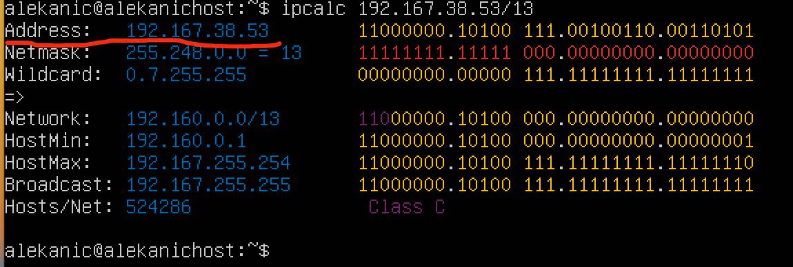\
*Вывод команды ipcalc*

2. **Переводы с помощью команды ipcalc** 

+ **Перевод маски 255.255.255.0 в префиксную и двоичную запись**

`Netmask` - маска подсети. `Wildcard` - обратная маска.

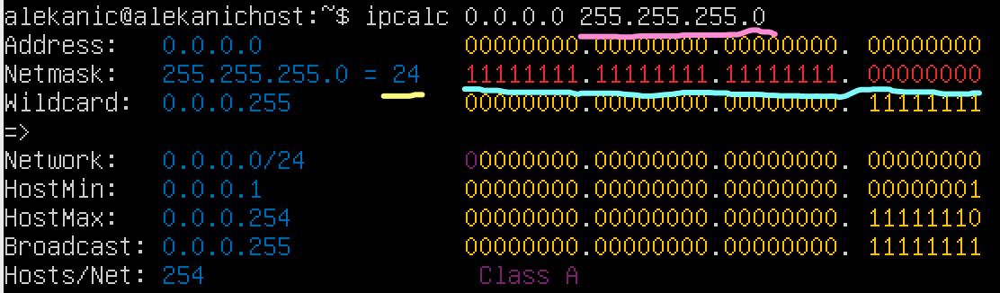\
*Вывод команды ipcalc для маски 255.255.255.0*

+ **/15 в обычную и двоичную**

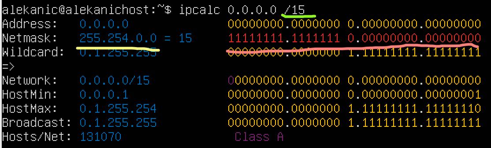\
*Вывод команды ipcalc для маски /15*

+ **11111111.11111111.11111111.11110000 в обычную и префиксную**

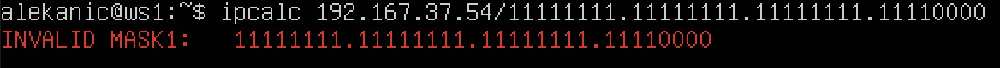\
*Вывод команды ipcalc для маски 11111111.11111111.11111111.11110000*\
\
Команда `ipcalc` не принимает написание маски в двоичном виде, поэтому необходимо заранее перевести исходную маску в двоичную запись:

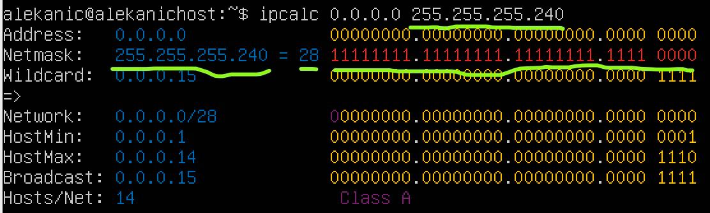\
*Вывод команды ipcalc для маски 11111111.11111111.11111111.11110000*

3. **Определение минимального и максимального хоста в сети 12.167.38.4**

`HostMax` - последний доступный IP-адрес для хостов. `HostMin` - самый первый (минимальный) доступный IP-адрес для хостов.

+ **при маске /8**

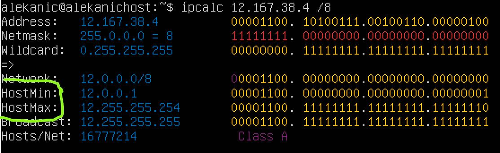\
*Определение минимального и максимального хоста для маски /8*

+ **при маске 11111111.11111111.00000000.00000000**

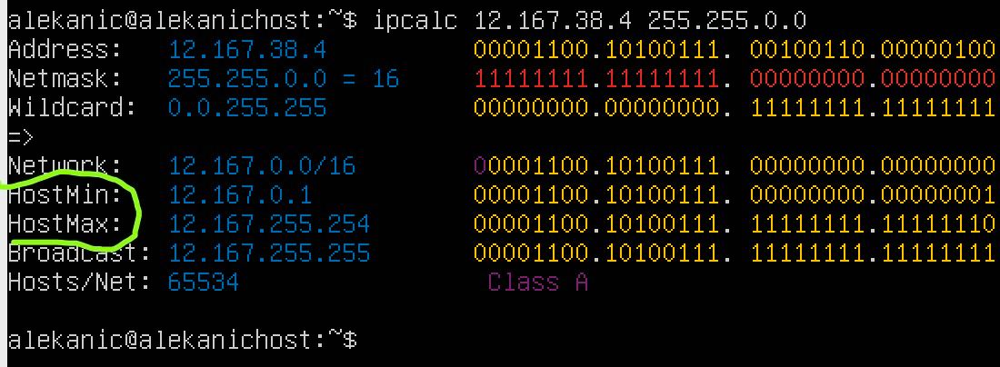\
*Определение минимального и максимального хоста для маски 11111111.11111111.00000000.00000000*

+ **при маске 255.255.254.0**

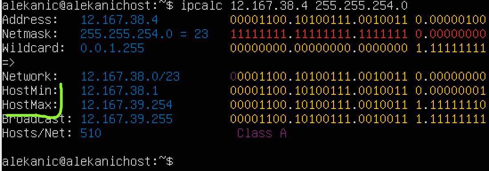\
*Определение минимального и максимального хоста для маски 255.255.254.0*

+ **при маске /4**

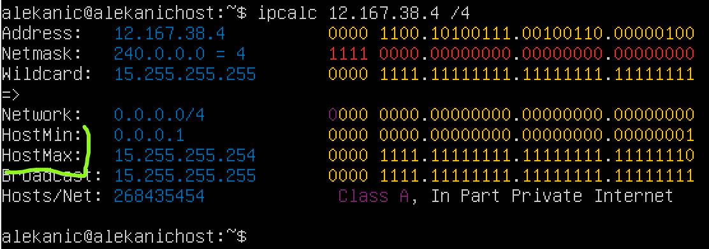\
*Определение минимального и максимального хоста для маски /4*

### <a id="title3">1.2. localhost</a>

>`localhost` - IP-адрес, который предназначен для обращения к той же самой машине, на которой происходит обращение. Может использоваться независимо от наличия у машины подключения к сети и вида оной.\
\
`loopback` или `localhost адреса` очень полезны для проверки работы TCP/IP. Независимо от наличия соединения с интернетом или локальной сетью, адреса из этого пула должны всегда пинговаться. Если этого не присходит, значит накрылась система (или она в процессе).\
\
Диапазон IP-аресов, предназначенных для создания локальных сетей:
127.0.0.1 - 127.255.255.255 (сеть 127.0.0.0/8). 

**Определить с помощью ipcalc, можно ли обратиться к приложению, работающему на localhost, со следующими IP:**

Нас интересует в строке `Hosts/Net` запись `loopback`.

+ **194.34.23.100**

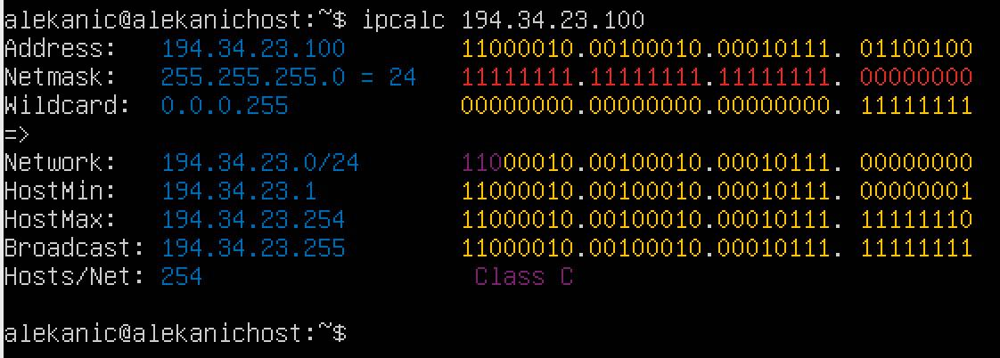\
*Обращение к адресу 194.34.23.100 :x:*

+ **127.0.0.2**

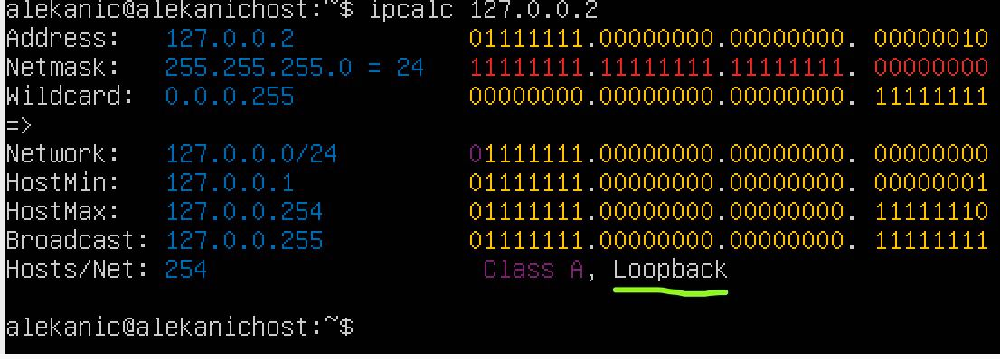\
*Обращение к адресу 127.0.0.2 :white_check_mark:*

+ **127.1.0.1**

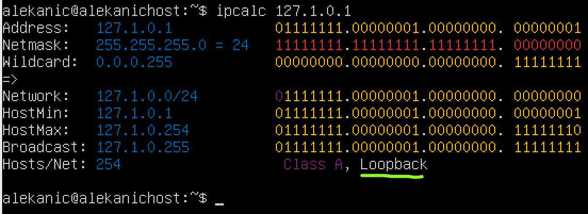\
*Обращение к адресу 127.1.0.1 :white_check_mark:*

+ **128.0.0.1**

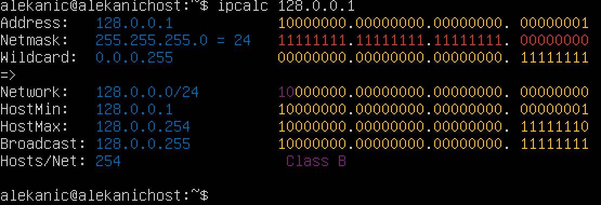\
*Обращение к адресу 128.0.0.1 :x:*

### <a id="title4">1.3. Диапазоны и сегменты сетей</a>

>Все пространство IP-адресов поделено на классы. Это решение получило название классовая адресация. Она уже давно устарела, но практически в любой книге на нее отводятся целые главы и разделы.\
\
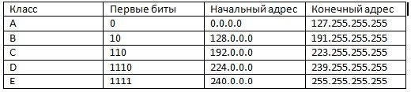\
*Классовая адресация*\
\
**Публичные адреса** - уникальные адреса, которые не должны повторяться в глобальной сети.\
**Частные адреса** - используются в локальных сетях и не маршрутизируются в глобальную сеть.\
\
Публичные адреса находятся в пределах от 1.0.0.1 до 233.255.255.254 за исключением IPv4.\
\
Адресное пространство частных IPv4-адресов состоит из 3 блоков:\
\
`10.0.0.0 - 10.255.255.255` (класс А)\
`172.16.0.0 - 172.31.255.255` (класс В)\
`192.168.0.0 - 192.168.255.255` (класс С)

1. **Определить, какие из перечисленных IP можно использовать в качестве публичного, а какие только в качестве частных:**

Если в строке `Hosts/Net` есть фраза `Private Internet`, то проверяемый IP-адрес принадлежит частной сети, и его нельзя использовать в качестве публичного.

:x: - частная сеть
:white_check_mark: - публичная сеть

+ **10.0.0.45**

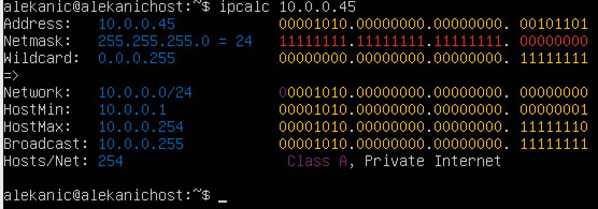\
*Обращение к адресу 10.0.0.45 :x:*

+ **134.43.0.2**

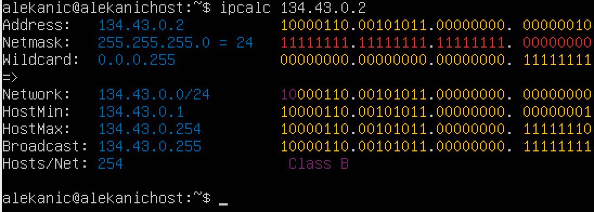\
*Обращение к адресу 134.43.0.2 :white_check_mark:*

+ **192.168.4.2**

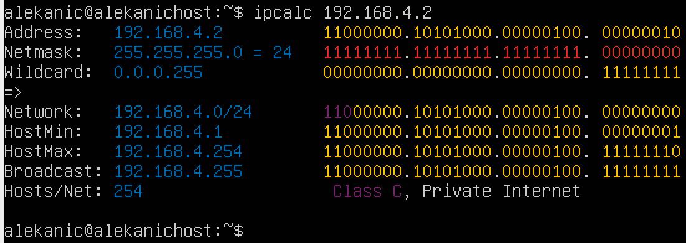\
*Обращение к адресу 192.168.4.2 :x:*

+ **172.20.250.4**

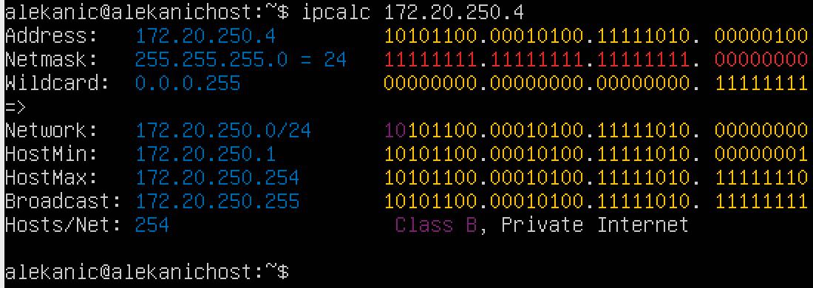\
*Обращение к адресу 172.20.250.4 :x:*

+ **172.0.2.1**

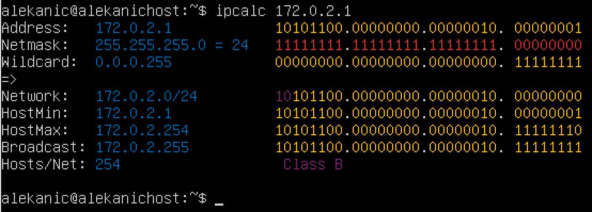\
*Обращение к адресу 172.0.2.1 :white_check_mark:*

+ **192.172.0.1**

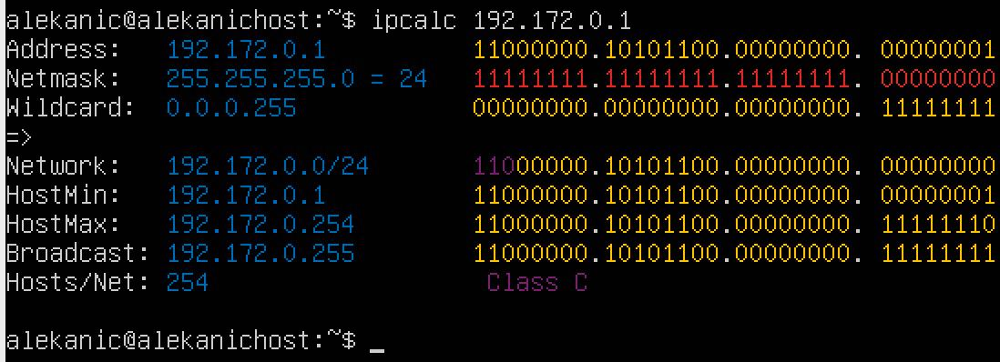\
*Обращение к адресу 192.172.0.1 :white_check_mark:*

+ **172.68.0.2**

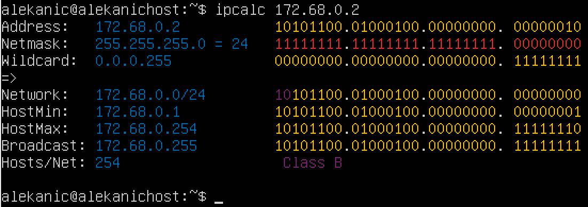\
*Обращение к адресу 172.68.0.2 :white_check_mark:*

+ **172.16.255.255**

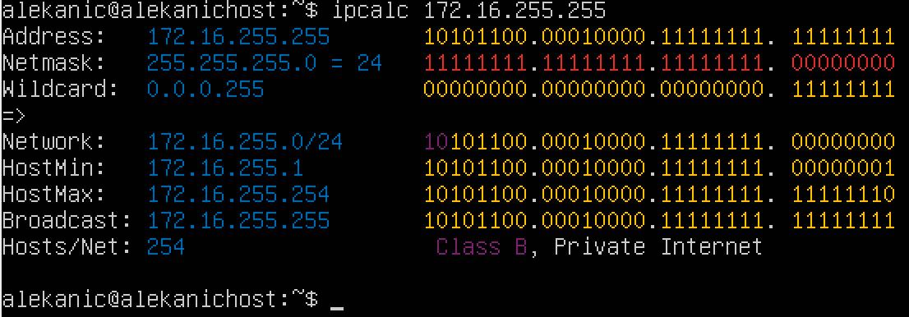\
*Обращение к адресу 172.16.255.255 :x:*

+ **10.10.10.10**

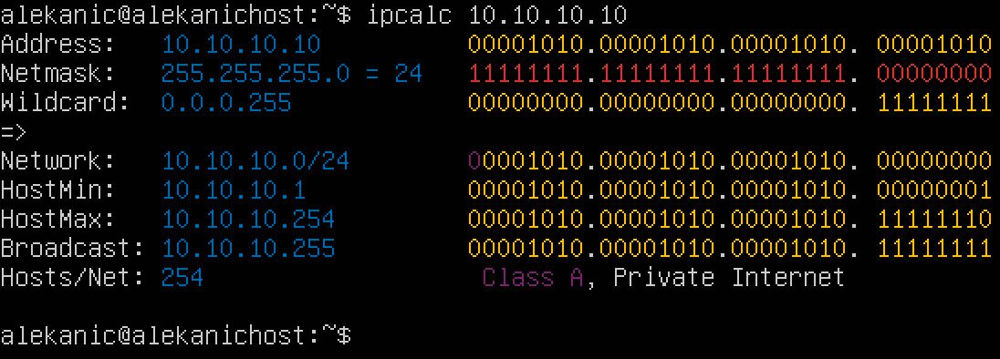\
*Обращение к адресу 10.10.10.10 :x:*

+ **192.169.168.1**

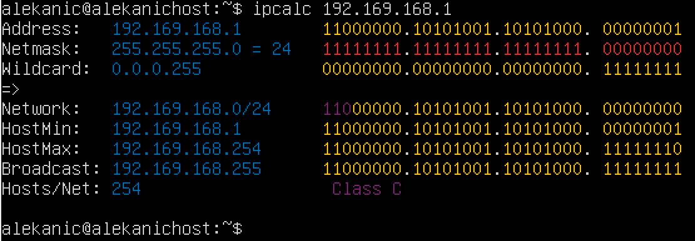\
*Обращение к адресу 192.169.168.1 :white_check_mark:*


2. **Определить, какие из перечисленных IP адресов шлюза возможны у сети 10.10.0.0/18:**

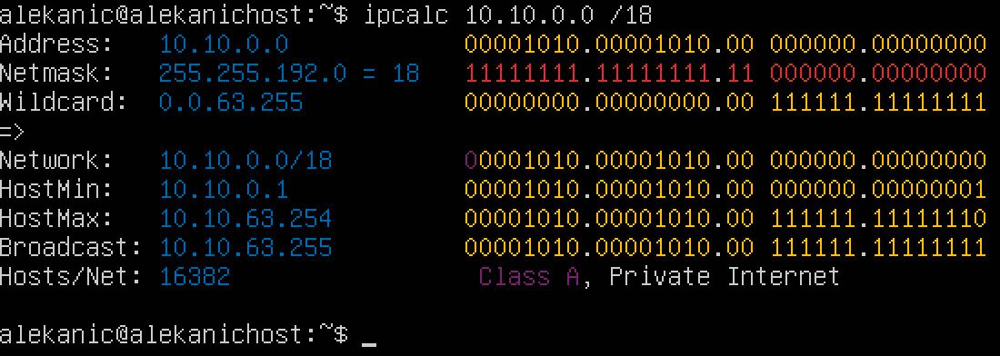\
*Обращение к адресу 10.10.0.0/18 :x:*

+ **10.0.0.1** - нет, меньше HostMin 
+ **10.10.0.2** - возможен
+ **10.10.10.10** - возможен
+ **10.10.100.1** - нет, больше HostMax
+ **10.10.1.255** - возможен

## <a id="title5">Part 2. Статическая маршрутизация между двумя машинами</a>

В этой части используются две виртуальные машины (далее - `ws1` и `ws2`).

>Сетевой интерфейс (сетевой адаптер) - это часть аппаратного устройства, которая позволяет ОС и программам передавать данные через компьютерную сеть. 

1. **С помощью команды `ip a` посмотреть существующие сетевые интерфейсы. В отчёт поместить скрин с вызовом и выводом использованной команды. Описать сетевой интерфейс, соответствующий внутренней сети.**

")\
*Cуществующие сетевые интерфейсы (ws1)*

")\
*Cуществующие сетевые интерфейсы (ws1)*

На обеих машинах есть 2 сетевых интерфейса: `lo` (loсalhost) и `enp0s3` (Ethernet).

+ `LOOPBACK` - означает, что интерфейс находится в состоянии `loopback`, то есть работает в режиме петли
+ `UP` - означает, что интерфейс активен
+ `LOWER_UP` - означает, что интерфейс находится в состоянии `UP` на нижнем уровне
+ `mtu 65536` - означает максимальный размер пакета, который может быть передан через этот интерфейс
+ `qdisc noqueue` - означает, что к этому интерфейсу не применимы очереди
+ `state UNKNOWN` - означает, что состояние интерфейса неизвестно
+ `group default` - означает, что интерфейс принадлежит к группе по умолчанию
+ `qlen 1000` - означает, что к интерфейсу подключено 1000 очередей
+ `link/loopback` - означает, что это интерфейс типа `loopback`
+ `00:00:00:00:00:00` - это MAC-адрес интерфейса
+ `127.0.0.1/8` - это IP-адрес интерфейса
+ `valid_lft forever preferred_lft forever` - означает, что срок действия и предпочтительный срок действия адреса не истекают
+ `::1/128` - это IPv6-адрес интерфейса

2. **На обеих машинах задать следующие адреса и маски: ws1 - 192.168.100.10, маска /16, ws2 - 172.24.116.8, маска /12. В отчёт поместить скрины с содержанием изменённого файла etc/netplan/00-installer-config.yaml для каждой машины.**

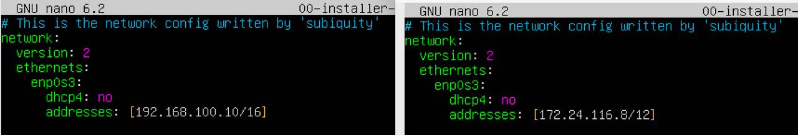\
*Измененные конфигурационные файлы для ws1 и ws2*

+ `network` - начало конфигурации
+ `ethernets` - вид сетевого интерфейса, который будет настраиваться в данной секции, в данном случае ethernets (физический, проводной).
+ `enp0s3` - имя сетевого интерфейса в системе
+ `dhcp4` - получение адреса IPv4 по DHCP
+ `addresses` - добавление статического адреса к интерфейсу, можно несколько

3. **Выполнить команду netplan apply для перезапуска сервиса сети. В отчёт поместить скрин с вызовом и выводом использованной команды.**
```
$ sudo netplan apply # применить конфигурацию
```
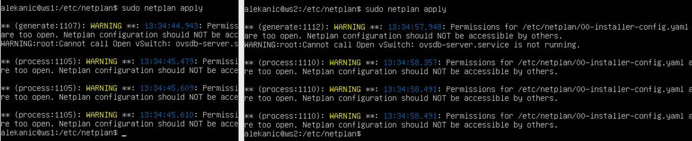\
*Вывод команды `netplan apply`*
```
$ sudo netplan try # применить конфигурацию с возможностью отмены
```
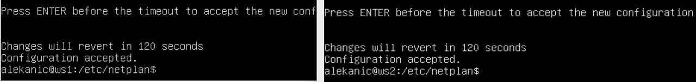\
*Вывод команды `netplan try`*

### <a id="title6">2.1. Добавление статического маршрута вручную</a>

+ **Добавить статический маршрут от одной машины до другой и обратно при помощи команды вида ip r add.**

>При использовании команды `ip r add`, новый маршрут добавляется в таблицу маршрутизации системы. Таблица маршрутизации - это БД, которая содержит информацию о том, как трафик должен быть направлен в системе.

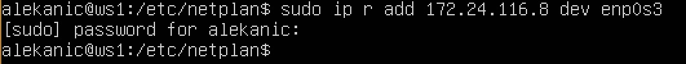\
*Добавление статического маршрута для ws1*

В данном случае мы добавляем статический маршрут к IP-адресу `172.24.116.8` через интерфейс `enp0s3`.\
`dev` - сокращение от device, это отсылка к сетевому интерфейсу.

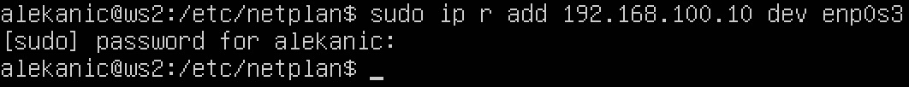\
*Добавление статического маршрута для ws2*

>*В целом, статические маршруты позволяют более точно контролировать, как трафик направляется в системе, что может быть полезно в различных сценариях, например:\
\
**Управление трафиком** - можно настроить статический маршрут, чтобы весь трафик к определенному IP-адресу проходил через определенный сетевой интерфейс. Это может быть полезно, если доступ к интернету ограничен или если необходимо контролировать, какой трафик проходит через определенный интерфейс.\
\
**Управление безопасностью** - например, определенный интерфейс защищен брандмауэром.\
\
**Управление производительностью** - например, определенный интерфейс имеет более высокую пропускную способность или меньшую задержку.*

+ **Пропинговать соединение между машинами.**

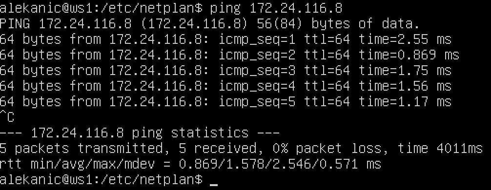\
*ping для ws1*

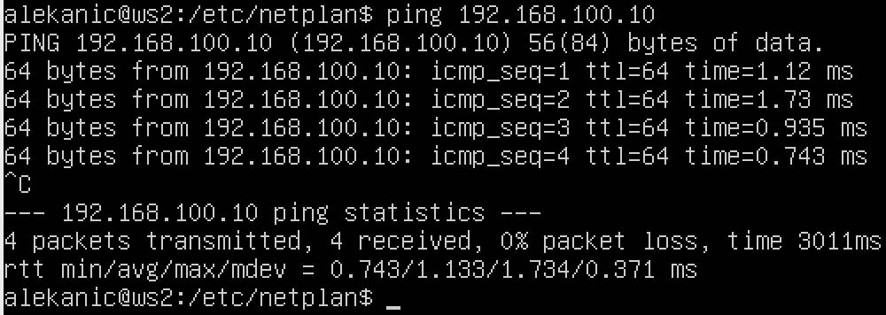\
*ping для ws2*

### <a id="title7">2.2. Добавление статического маршрута с сохранением</a>

+ **Перезапустить машины**
```
$ reboot
```
+ **Добавить статический маршрут от одной машины до другой с помощью файла etc/netplan/00-installer-config.yaml. В отчёт поместить скрин с содержанием изменённого файла etc/netplan/00-installer-config.yaml.**

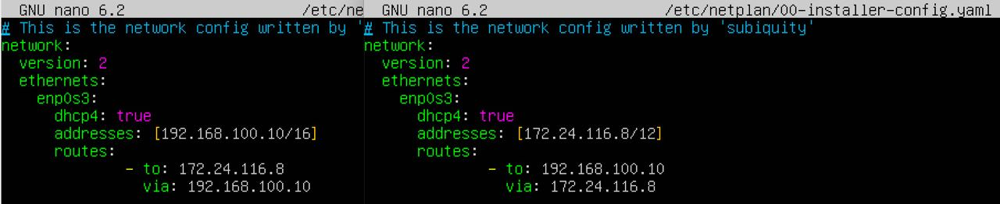\
*Изменения в конфигурационном файле*

+ **Пропинговать соединение между машинами. В отчёт поместить скрин с вызовом и выводом использованной команды.**

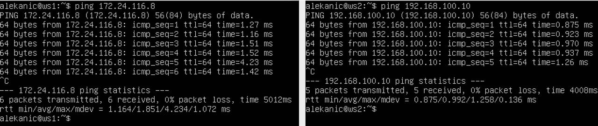\
*ping для ws1 и ws2 с новым конфигурационным файлом*

## <a id="title8">Part 3. Утилита iperf3</a>

В данном задании используются виртуальные машины `ws1` и `ws2`.

>Консольная утилита `iperf3` презначначена для того, чтобы измерять пропускную способность сети. Она поддерживает работу как по протоколу TCP, так и по UDP. Для проведения тестирования надо запустить iperf3 как на сервере, так и на клиенте. Клиентская часть будет генерировать трафик, а серверная - принимать и отбрасывать.\
\
`iperf3` позволяет максимально загрузить канал между клиентом и сервером, что покажет его максимальную пропускную способность в конкретный момент.

### <a id="title9">3.1. Скорость соединения</a>

**Перевести и записать в отчёт:**

+ **8 Mbps в MB/s:** 8 Mbs = 1 MB/s
+ **100 MB/s в Kbps:** 100 MB/s = 819 200 Kbps 
+ **1 Gbps в Mbps:** 1 Gbps = 1024 Mbps

### <a id="title10">3.2. Утилита iperf3</a>

+ **Измерить скорость соединения между ws1 и ws2. В отчёт поместить скрины с вызовом и выводом использованных команд.**

Запуск серверной версии на ws1:
```
iperf3 -s
```
При запуске этой команды, сервер начнет слушать порт 5201 на всех сетевых интерфейсах. Можно забиндить его на определенный IP командой:
```
iperf3 -s -D -B [IP]
```
Пока идет тестирование, нужно держать iperf3 запущенным, поэтому для удобства можно запустить утилиту в качестве демона командой:
```
iperf3 -s -D
```
Запуск клиентской версии происходит командой:
```
iperf3 -c 192.168.100.10
```
<span style="color: blue;">А дальше у меня началась 4-х часовая головная боль, со StackOverflow, c GPT и какими-то очень сомнительными английскими форумами по поводу ошибки:</span>

```
iperf3: error - unable to send control message: Bad file descriptor
```

\
*Мое отчаяние в этот момент*

<span style="color: blue;">*Так что если у вас возникла такая же проблема, поздравляю! Вы не очень вдумчиво делали первый проект по Linux, и зачем-то установили себе фаервол, когда не надо было. Отключите его командой:*</span>
```
$ sudo ufw disable
```
<span style="color: blue;">Выдыхаем, можно жить дальше.</span>

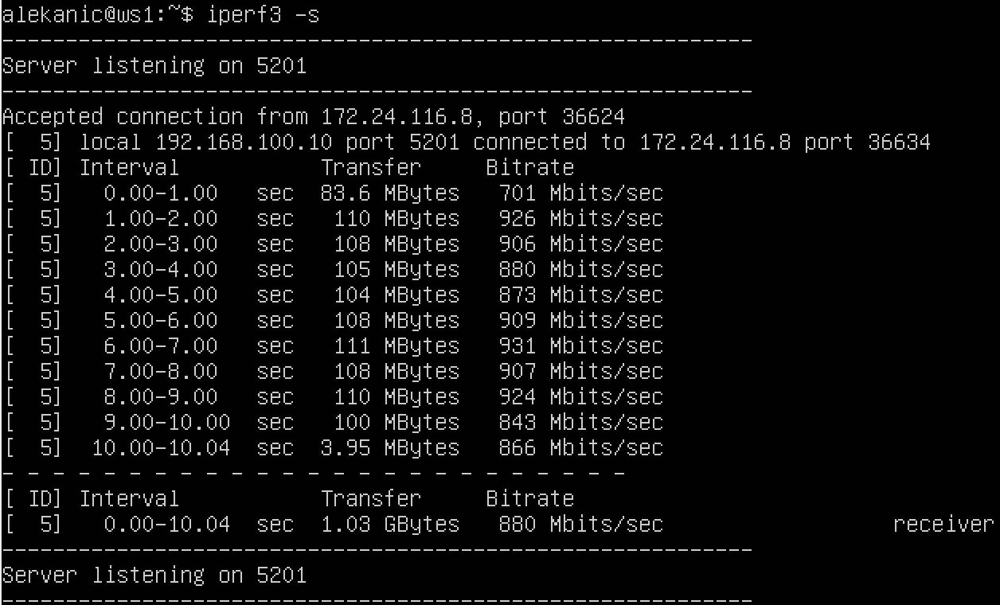\
*Запуск ws1 в качестве сервера командой iperf3*

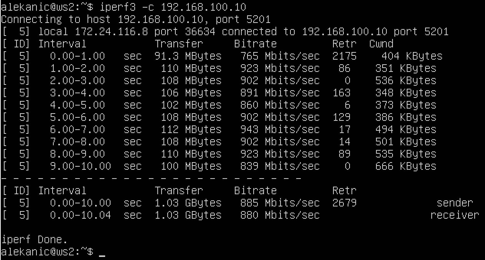\
*Запуск ws2 в качестве клиента командой iperf3*

Скорость передачи данных:

+ Для sender (ws1) - 885 Mbits/sec
+ Для reveiber (ws2) - 880 Mbits/sec

## <a id="title11">Part 4. Сетевой экран</a>

В данном задании используются виртуальные машины `ws1` и `ws2`.

### <a id="title12">4.1. Утилита iptables</a>

>`iptables` - утилита, позволяющая управлять входящими и исходящими пакетами данных. Это основной инструмент для настройки межсетевых экранов в системах Linux.\
\
`iptables` работает путем проверки пакетов данных на соответствие определенным критериям и выполняния заданных действий, если пакеты соответствуют этим критериям. Эти критерии и действия определяются в таблицах, которые состоят из набора правил.\
\
Под контроль попадают все данные, входящие на сервер, исходящие из него или проходящие через него как маршрутизатор. Такой подход создает сплошной защитный экран (файрвол).

Для использования утилиты, ее нужно скачать:

`$ sudo apt install iptables`

1. **Создать файл /etc/firewall.sh, имитирующий фаерволл, на ws1 и w2**
```
!/bin/sh\
Удаление всех правил в таблице «filter» (по-умолчанию).\
iptables -F\
iptables -X
```
```
$ sudo touch /etc/firewall.sh - создание файла
```
2. **Добавить в файл подряд следующие правила:**

- **На `ws1` применить стратегию, когда в начале пишется запрещающее правило, а в конце пишется разрешающее правило (это касается пунктов 4 и 5).**
- **На `ws2` применить стратегию, когда в начале пишется разрешающее правило, а в конце пишется запрещающее правило (это касается пунктов 4 и 5).**
- **Открыть на машинах доступ для порта 22 (ssh) и порта 80 (http).**
- **Запретить echo reply (машина не должна «пинговаться», т.е. должна быть блокировка на OUTPUT).**
- **Разрешить echo reply (машина должна «пинговаться»).**\
\
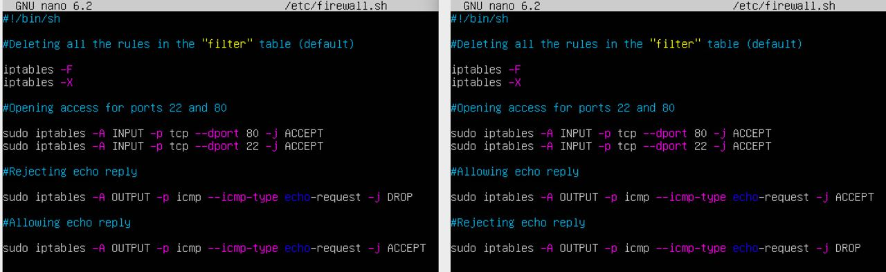\
*Cодержание firewall.sh для ws1 и ws2*

+ `INPUT` - эта цепочка правил, которые применяется к пакетам, предназначенным для самой системы
+ `OUTPUT` - эта цепочка правил, которые исходят из системы
+ `ACCEPT` - пропустить данный пакет по цепочке
+ `DROP` - полностью удалить пакет
+ `-A (-append)` - добавляет новое правило в цепочку
+ `-F (-flush)` - очистить все правила
+ `-X (-delete-chain)` - удалить цепочку
+ `-p (-protocol)` - вручную установить протокол (TCP, UDP, UDPLITE, ICMP, ICMPv6, ESP, AH, SCTP, MH)
+ `-j (-jump)` - когда правило подошло - выполнить указанное действие
+ `-dport (-destination-port)` - порт получателя пакета

Чтобы запустить исполняемые файлы, на обеих машинах надо ввести команды:
```
$ sudo chmod +x /etc/firewall.sh
$ sudo sh /etc/firewall.sh
```
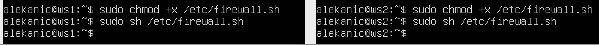\
*Cодержание firewall.sh для ws1 и ws2*

Разница в стратегиях заключается в том, что на машине `ws1` первым подходящим правилом будет запрет на `echo-request` (с этой машины нельзя пинговать), и второе правило (ACCEPT) будет игнорироваться. 

А на второй машине - `ws2` первым подходящимм правилом будет разрешение на `echo-request`, и второе правило (DROP) будет игнорироваться.

>`echo-request/echo-reply` - это пинг (из расшифровки кодов ICMP-сообщений).\
\
`ping` - это служебная компьютерная программа, предназначенная для проверки соединений в сетях на основе TCP/IP. Компьютер или маршрутизатор посылает по составной сети ICMP-сообщение echo-request, указывая в нем IP-адрес узла, достижимость которого нужна проверить. Узел, получивший echo-request, формирует и отправляет echo-request отправителю запроса.

### <a id="title13">4.2. Утилита nmap</a>

>В фильме "Матрица" при взломе используется `nmap`. Тринити делает все правильно! Взламывая городскую электросеть, она с помощью nmap ищет уязвимости SSH-сервера, и далее использует эксплойт SSH1 CRC32 2001 года.
/
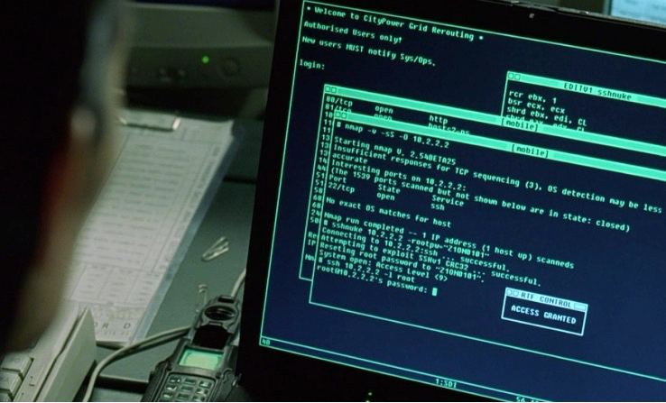\
*nmap в Голливуде*\
\
`nmap (Network Mapper)` - это инструмент для исследования сети и проверки безопасности. Использует "сырые" IP-пакеты оригинальным способом, чтобы определить какие хосты доступны в сети, какие службы они предлагают, какие ОС используют, какие типы пакетных фильтров/брандмауэров используются и множество других характеристик.\
\
Выходные данные `nmap` - список просканированных целей с дополнительной информацией по каждой из них в зависимости от заданных опций. 

+ **С помощью команды `ping` найти машину, которая не «пингуется».**

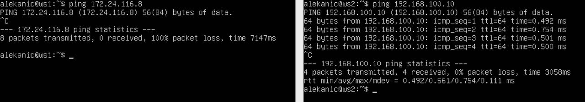\
*Пинг ws1 и ws2*

На ws1 была задана блокировка на OUTPUT, поэтому ping с нее невозможен. 

+ **C помощью утилиты nmap показать, что хост машины запущен. Проверка: в выводе nmap должно быть сказано: `Host is up`.**

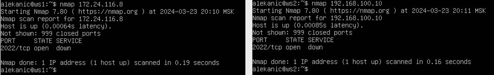\
*Проверка через nmap*

Вывод `nmap` говорит о том, что хост 172.24.116.8 (у ws1)/192.168.100.10 (у ws2) активен, порт 2022 открыт, однако сервис на этом порту не работает, или не отвечает на запросы (`SERVICE DOWN`).

## <a id="title14">Part 5. Статическая маршрутизация сети</a>

В данной части требуется поднять пять виртуальных машин (3 рабочие станции (ws11, ws21, ws22) и 2 роутера (r1, r2)).

### <a id="title15">5.1. Настройка адресов машин</a>

+ **Настроить конфигурации машин в etc/netplan/00-installer-config.yaml согласно сети на рисунке.**

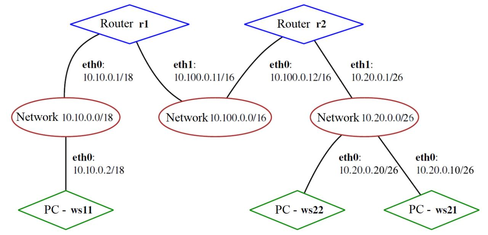\
*Задание*

Чтобы иметь возможность использовать несколько сетевых интерфейсов (по умолчанию он один), нужно изменить настройки машин в VirtualBox: подключить несколько адаптеров (один адаптер - один сетевой интерфейс), и выбрать тип подключения к сети на каждом адаптере.

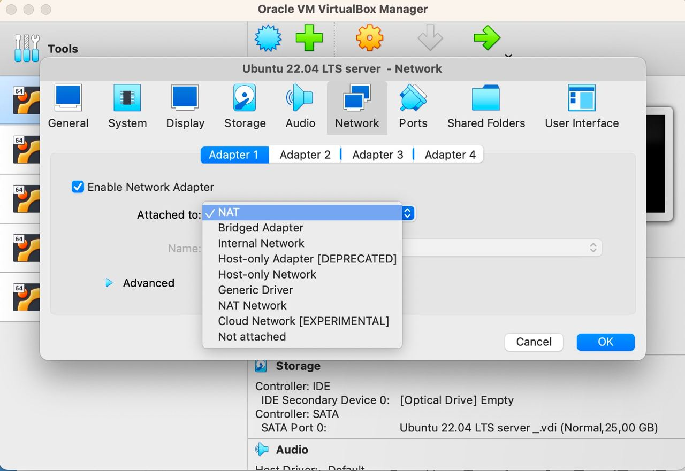\
*ws1*

Я выбрала `Bridged Adapter`, потому что мне ~~не хотелось разбираться как настраивать общую NAT-сеть~~ показалось это хорошей идеей. Поэтому на всех машинах, на всех адаптерах был использован только `Bridged Adapter`.

>`NAT (Nerwork Address Translation)` - позволяет ВМ подключаться к интернету через хост-систему. NAT автоматически назначает IP-адрес ВМ и перенаправляет трафик через хост-систему.\
\
`Bridged Adapter` - позволяет виртуалкам подключаться к сети напрямую, как если бы она была физическим устройством. В этом случае ВМ получает IP-адрес от DHCP-сервера или назначает его вручную.\
\
`Internal Nerwork` - позволяет виртуалкам подключаться друг к другу, но не к интернету. Это полезно, если есть цель создать частную сеть между несколькими виртуалками.\
\
`Host-only Network` - позволяет ВМ подключаться только к хост-системе и другим ВМ, которые также используют этот тип подключения.

Проверяем названия сетевых интерфейсов:
``
ip a
``
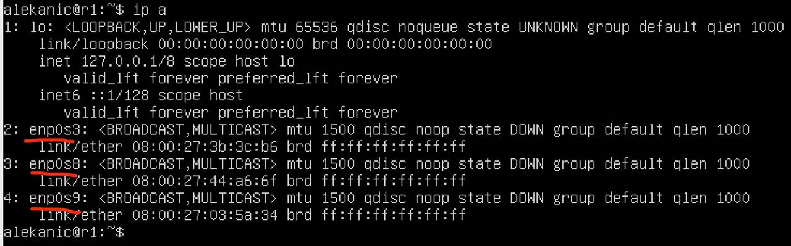\
*Устаревший скриншот, но хороший пример*

У хоста под названием `r1` на данный момент есть 4 сетевых интерфейса:

1 - `lo`\
2 - `enp0s3`\
3 - `enp0s8`\
4 - `enp0s9`\

С новыми настройками, у машин следующие интерфейсы:

+ У ws11, ws21, ws22 всего 2 сетевых интерфейса: `lo` и `enp0s3`;
+ У r1 и r2 - сетевых интерфейса: `lo`, `enp0s3`, `enp0s8`.

Настройка конфигураций машин проводится через `netplan`:
```
$ sudo nano /etc/netplan/00-installer-config.yaml
```
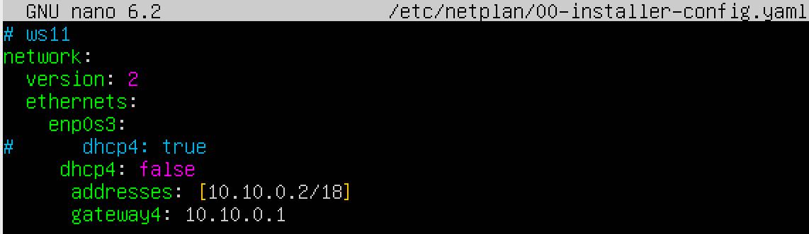\
*yaml у ws11*\
\
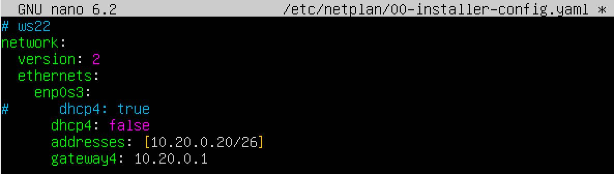\
*yaml у ws22*\
\
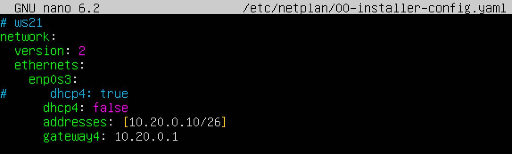\
*yaml у ws21*\
\
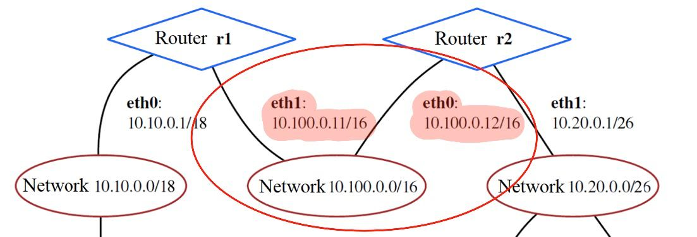\
*Еще раз внимание на картинку*\
\
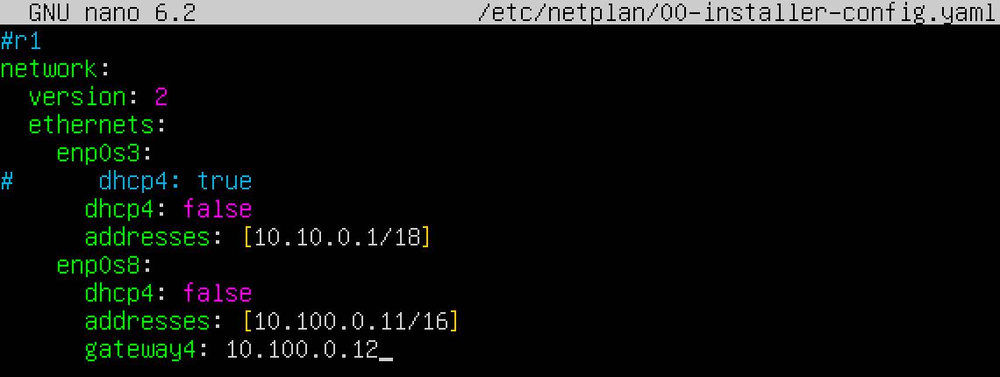\
*yaml у r1*

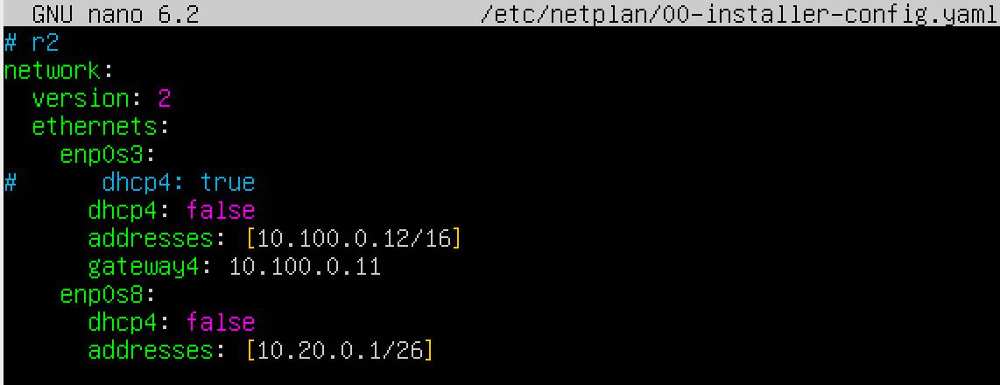\
*yaml у r2*

+ `routes` - это набор правил, которые определяют, как трафик должен быть маршрутизирован в сети. Они могут указывать, какие IP-адреса должны быть маршрутизированы через определенный шлюз или интерфейс. `to` - к какому адресу, `via` - через какой адрес.

+ `gateway` - это IP-адрес шлюза по умолчанию, который используется для маршрутизации трафика в сеть. Это обычно IP-адрес маршрутизатора или другого устройства, которое может перенаправлять трафик между сетями. 

+ **Перезапусти сервис сети. Если ошибок нет, то командой ip -4 a проверь, что адрес машины задан верно.**

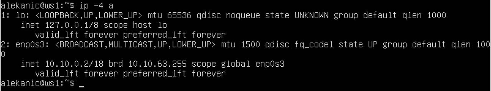\
*Вывод команды ip -4 a для ws11*\
\
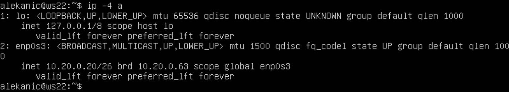\
*Вывод команды ip -4 a для ws22*\
\
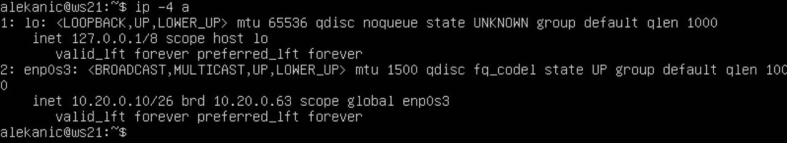\
*Вывод команды ip -4 a для ws21*\
\
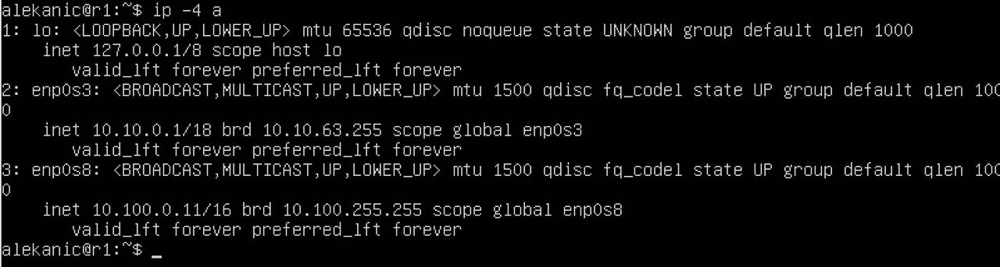\
*Вывод команды ip -4 a для r1*\
\
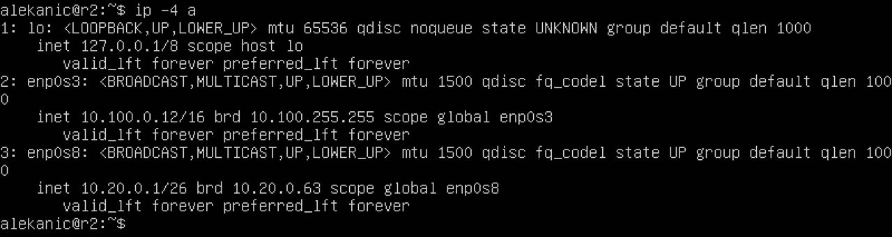\
*Вывод команды ip -4 a для r2*

+ **Также пропингуй ws22 с ws21. Аналогично пропингуй r1 с ws11.**

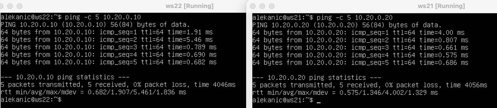\
*Пинг ws22 и ws21*\
\
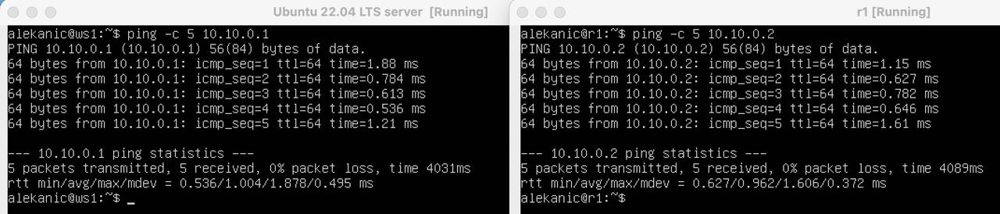\
*Пинг r1 и ws11*

### <a id="title16">5.2. Включение переадресации IP-адресов</a>

>`sysctl` - это утилита, предназначенная для считывания и управления параметрами ядра. Позволяет читать и изменять параметры ядра, такие как сегмент разделяемой памяти, ограничение на число запущенных процессов, а также включать функции, такие как маршрутизация.

Для включения переадресации IP, на роутерах нужно выполнить следующую команду:
```
sysctl -w net.ipv4.ip_forward=1
```
Эта команда устанавливает значение параметра ядра net.ipv4.ip_forward в 1, что означает, что ядро будет пересылать пакеты между различными сетевыми интерфейсами.

:speech_balloon: При использовании этой команды, переадресация не будет работать после перезагрузки системы.

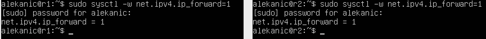\
*Выполнение команды sysctl на r1 и r2*\
\
Чтобы сохранить значения изменяемых параметров, нужно открыть файл `/etc/sysctl.conf` и раскомментировать там следующую строку:
```
net.ipv4.ip_forward = 1
```

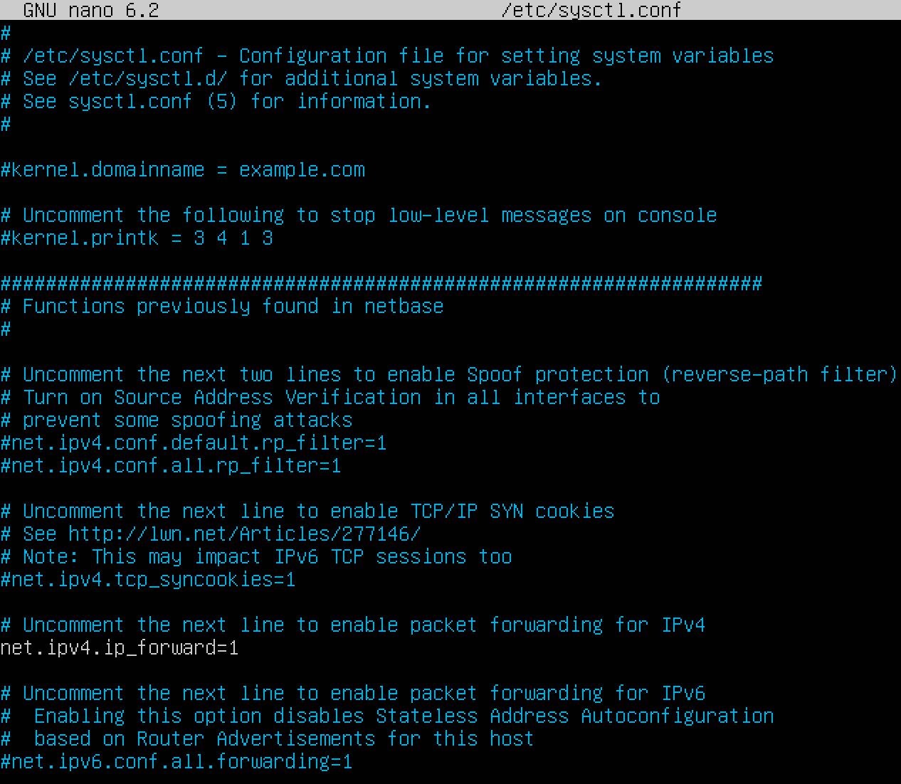\
*Cодержание файла /etc/sysctl.conf*

### <a id="title17">5.3. Установка маршрута по-умолчанию</a>

Пример вывода команды `ip r` после добавления шлюза:
```
default via 10.10.0.1 dev eth0
10.10.0.0/18 dev eth0 proto kernel scope link src 10.10.0.2
```
+ **Настроить маршрут по-умолчанию (шлюз) для рабочих станций. Для этого добавить default перед IP роутера в файле конфигураций. В отчёт поместить скрин с содержанием файла etc/netplan/00-installer-config.yaml**

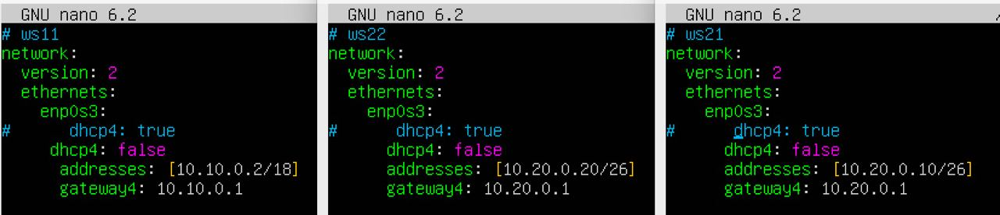\
*Установка шлюза по умолчанию*

+ **Вызвать `ip r` и показать, что маршрут добавился в таблицу маршрутизации. В отчёт поместить скрин с вызовом и выводом использованной команды.**

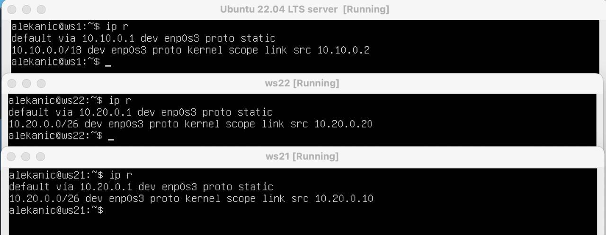\
*Подтверждение добавления маршрута*

+ **Пропинговать ws11 и r2, и показать на r2, что пинг доходит с помощью следующей команды:**
```
$ sudo tcpdump -tn -i enp0s8
```
>`tcpdump` - это утилита, которая позволяет перехватывать и анализировать сетевой трафик, проходящий через компьютер. Она может быть использована для отладки сетевых приложений, отладки сети и сетевой конфигурации, а также для анализа передаваемых пакетов.

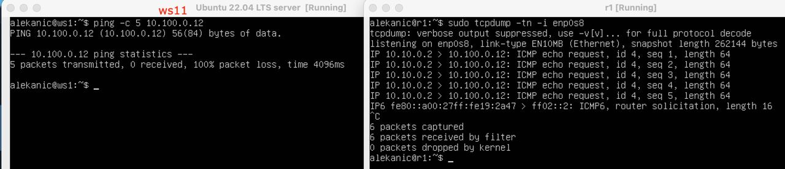\
*ping ws11 -> r2, tcpdump на r2*

+ `-i` - параметр, с помощью которого можно указать сетевой интерфейс, с которого следует принимать данные;
+ `-t` - выводить пакеты в текстовом формате
+ `-n` - не использовать DNS для преобразовывания IP-адресов в имена хостов

### <a id="title18">5.4. Добавление статических маршрутов</a>

+ **Добавить в роутеры r1 и r2 статические маршруты в файле конфигураций. Пример для r1 маршрута в сетку 10.20.0.0/26:**
```
# Добавить в конец описания сетевого интерфейса eth1:
- to: 10.20.0.0
  via: 10.100.0.12
```

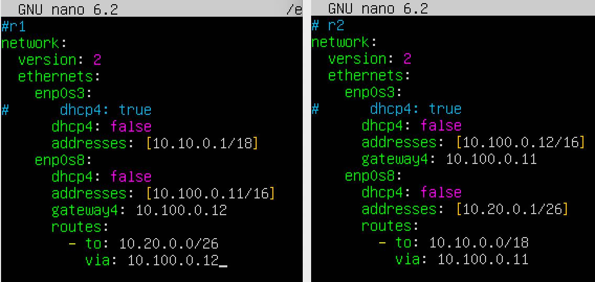\
*Добавление статических маршрутов для r1 и r2*

+ **Вызвать `ip r` и показать таблицы с маршрутами на обоих роутерах. Пример таблицы на r1:**

```
10.100.0.0/16 dev eth1 proto kernel scope link src 10.100.0.11
10.20.0.0/26 via 10.100.0.12 dev eth1
10.10.0.0/18 dev eth0 proto kernel scope link src 10.10.0.1
```

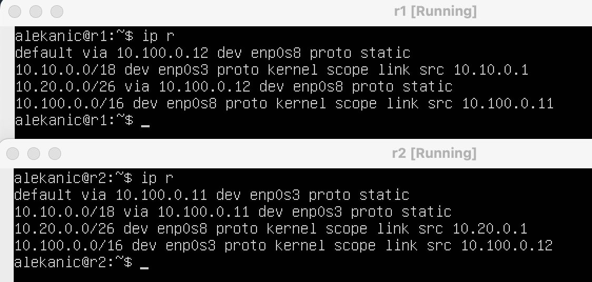\
*Проверка маршрутов на роутерах*

+ **Запустить следующие команды на `ws11`**:
```
ip r list 10.10.0.0/[маска сети]
ip r list 0.0.0.0/0
```
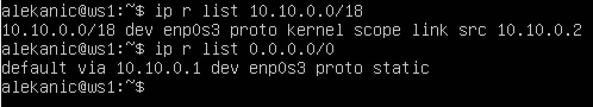\
*Проверка с помощью команды ip r*

+ **Объяснить, почему для адреса `10.10.0.0/[маска сети]` был выбран маршрут, отличный от `0.0.0.0/0`, хотя он попадает под маршрут по-умолчанию.**

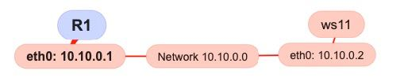\
*Схема связи от ws11 к r1*\
\
В файле `/etc/00-installer-config.yaml` у `ws11` указан шлюз по умолчанию `10.10.0.1`. Сеть `0.0.0.0` находится не в одной сети с `ws11`, нельзя отправить их напрямую, поэтому пакеты отправляются через шлюз, как в пункт дальнейшей рассылки.

А для сети `10.10.0.0` был выбран маршрут через `10.10.0.2`, поэтому что `ws11` находится в сети `10.10.0.0`, и ей не нужны никакие промежуточные пункты для отправки пакетов:

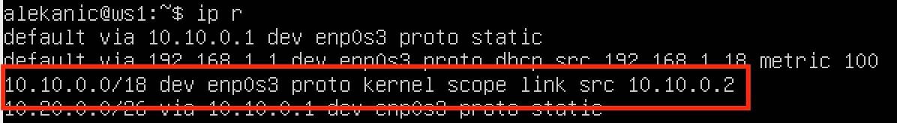\
*Схема связи от ws11 к r1*

### <a id="title19">5.5. Построение списка маршрутизаторов</a>

Пример вывода утилиты traceroute после добавления шлюза:

```
1 10.10.0.1 0 ms 1 ms 0 ms
2 10.100.0.12 1 ms 0 ms 1 ms
3 10.20.0.10 12 ms 1 ms 3 ms
```

+ **Запустить на r1 команду дампа: `tcpdump -tnv -i enp0s3`**
+ **При помощи утилиты traceroute пострить список маршрутизаторов на пути от ws11 до ws21.**

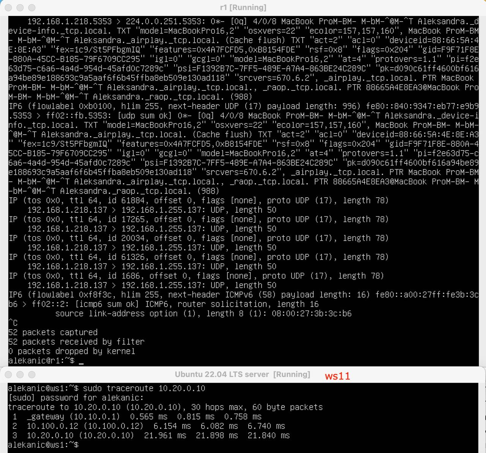\
*Вызов команд tcpdump и traceroute*

Чтобы построить маршрут от `ws11` (10.10.0.2/18) до `ws21` (10.20.0.10/26), с машины `ws11` отправляем запрос по адресу ws21.

>`tcpdump` используется для перехвата и анализа сетевого трафика. Она может быть полезна для обнаружения проблем с сетевым соединением, таких как потеря пакетов, неправильная маршрутизация или проблемы с безопасностью.\
\
`traceroute` - используется для определения пути, по которому пакеты проходят от источника до целевого хоста. Это может быть полезно для выявления узких мест в сети или проблем с маршрутизацией.\
\
Если `traceroute` показывает, что пакеты достигают определенного узла, но затем теряются, `tcpdump` может быть использован для проверки, действительно ли пакеты теряются на этом узле или проблема нааходится дальше по маршруту.

+ **В отчёте, опираясь на вывод, полученный из дампа на r1, объяснить принцип работы построения пути при помощи traceroute.**

  1. Шлюз по умолчанию - gateway (10.10.0.1), потому что адрес находится не в одной подсети с `ws11`
  2. Потом из `r1` в `r2` (10.100.0.12) через 10.10.0.11
  3. В `ws21` (10.20.0.10), так как они в одной подсети с `r2`. 

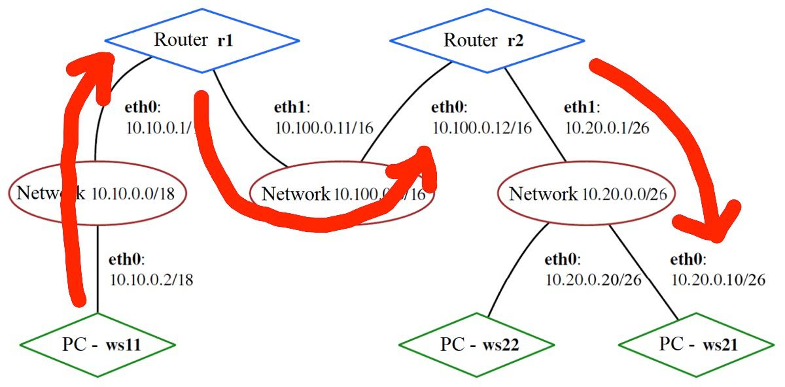\
*Памятка*

Вывод из tcpdump: через `r1` пакеты через него проходят, потерь нет.

>`traceroute` - утилита комантной строки, которая используется для определения пути, по которому пакеты проходят от источника до целевого хоста в сети. Принцип работы `traceroute` основан на использовании времени жизни (Time To Live, TTL) IP-пакетов.\
\
Когда пакет отправляется через сеть, ему присваивается значение TTL, которое уменьшается на единицу каждый раз, когда пакет проходит через промежуточный узел (например, маршрутизатор). Когда TTL достигает нуля, пакет уничтожается, и отправителю отправляется сообщение об ошибкке ICMP Time Exceeded.\
\
`traceroute` использует эту особенность, отправляя серию пакетов с постепенно увеличиващимся значением TTL. Каждый маршрутизатор на пути следования пакета уменьшает TTL на единицу, и когда TTL достигает нуля, маршрутизатор отправляет обратно сведение об ошибке. `traceroute` записывает время, затраченное на полчение этих сообщений, и таким образом определеяет промежуточные узлы на пути к целевому хосту.\
\
Каждое промежуточное звено на пути следования пакета отображается в выводе `traceroute` в виде пары IP-адрес/имя узла и времени, затраченного на прохождение пакета через этот узел. Таким образом, `traceroute` позволяет опреедлить не только конечный пункт назначения, но и все промежуточные узлы, через которые проходит пакет.

### <a id="title20">5.6. Использование протокола ICMP при маршрутизации</a>

+ **Запустить на r1 перехват сетевого трафика, проходящего через enp0s3 с помощью команды: `tcpdump -n -i enp0s3 icmp`**

+ **Пропинговать с ws11 несуществующий IP (например, 10.30.0.111) с помощью команды: `ping -c 1 10.30.0.111`**

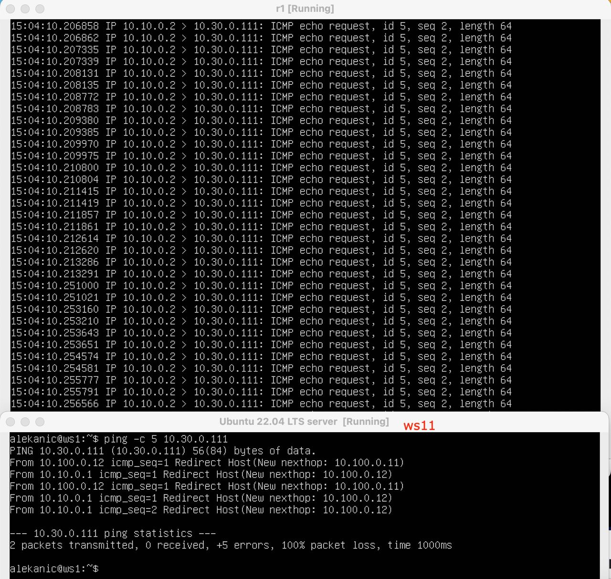\
*tcpdump с перехватом трафика по icmp, ping ws11 и несуществующего IP*

Пакеты перехватываются на `r1`, поэтому на `ws11` приходят рекомендации сменить хоста, через которого проложен маршрут.

## <a id="title21">Part 6. Динамическая настройка IP с помощью DHCP</a>

В данном задании используются виртуальные машины из Части 5.

>`DHCP (Dynamic Host Configuration Protocol)` - это сетевой протокол, который позволяет сетевым устройствам автоматически получать IP-адрес и другие параметры, необходимые для работы в сети TCP/IP.\
\
Протокол работает по модели "клиент-сервер", где клиентское устройство обращается к серверу DHCP и получает от него нужные параметры. Это позволяет избежать ручной настройки компьютеров сети и уменьшает количество ошибок.

1. **Для r2 настроить в файле `/etc/dhcp/dhcpd.conf` конфигурацию службы DHCP:**

  + **Указать адрес маршрутизатора по-умолчанию, DNS-сервер и адрес внутренней сети. Пример файла для r2:**
```
subnet 10.100.0.0 netmask 255.255.0.0 {}

subnet 10.20.0.0 netmask 255.255.255.192
{
    range 10.20.0.2 10.20.0.50;
    option routers 10.20.0.1;
    option domain-name-servers 10.20.0.1;
}
```
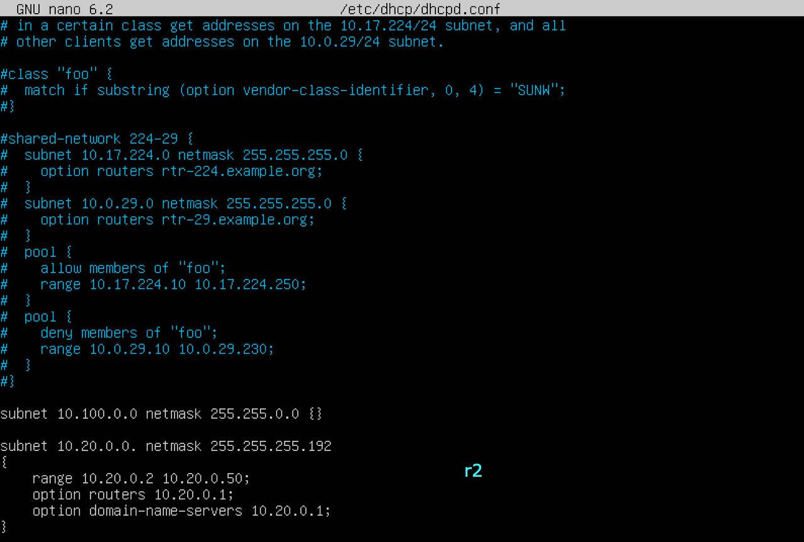\
*Измененный файл /etc/dhcp/dhcpd.conf для r2*

  + **В файле `/etc/resolv.conf` прописать `nameserver 8.8.8.8`**.

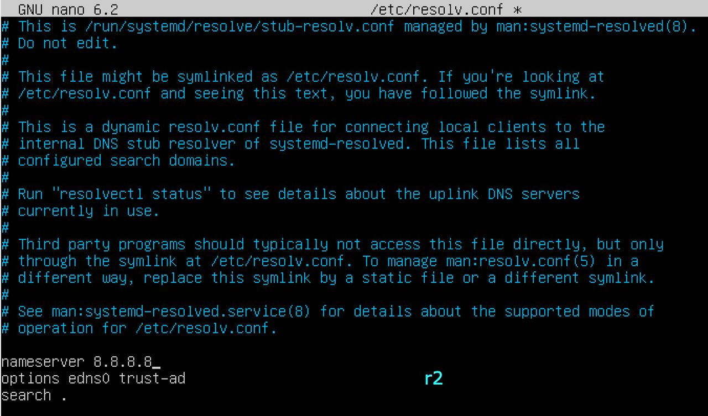\
*Измененный файл `/etc/resolv.conf`*

  + **Перезагрузить службу DHCP командой `systemctl restart isc-dhcp-server`. Машину ws21 перезагрузить при помощи `reboot` и через `ip a` показать, что она получила адрес.**

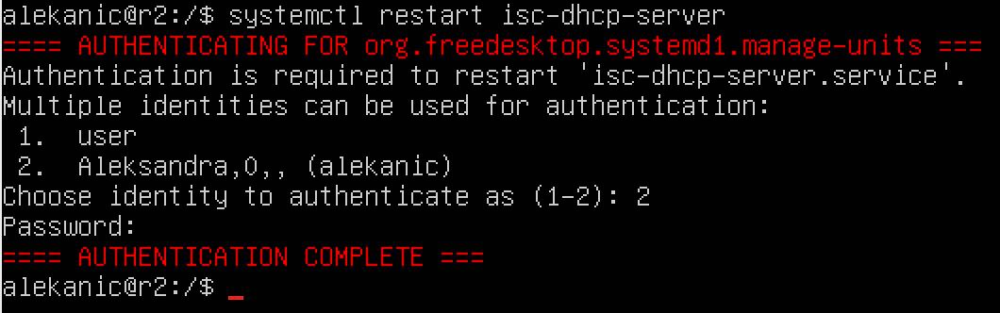\
*Перезагрузка службы DHCP*

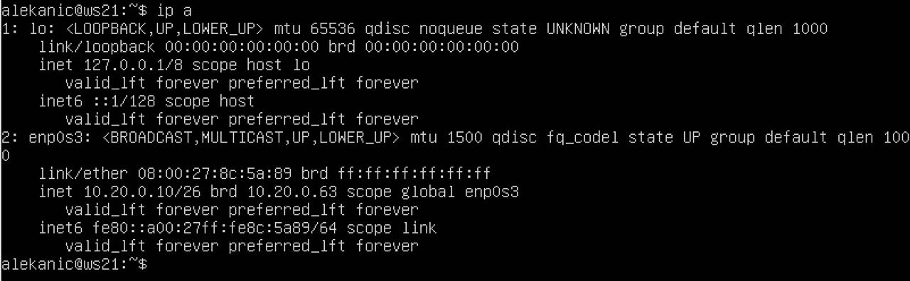\
*Проверка, что машина ws21 получла dhcp адрес*

+ **Пропинговать ws22 с ws21**.

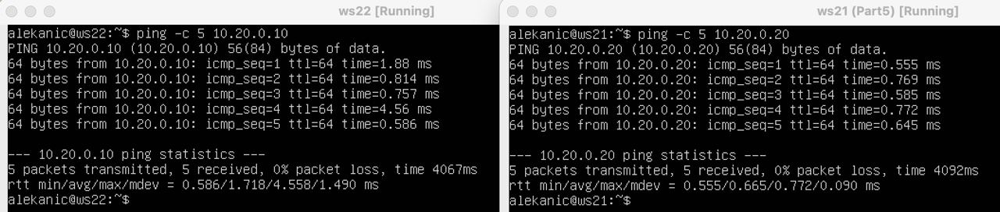\
*Пинг ws22 и ws21*

+ **Указать MAC адрес у ws11, для этого в `etc/netplan/00-installer-config.yaml` надо добавить строки**:

```
macaddress: 10:10:10:10:10:BA
dhcp4: true
```
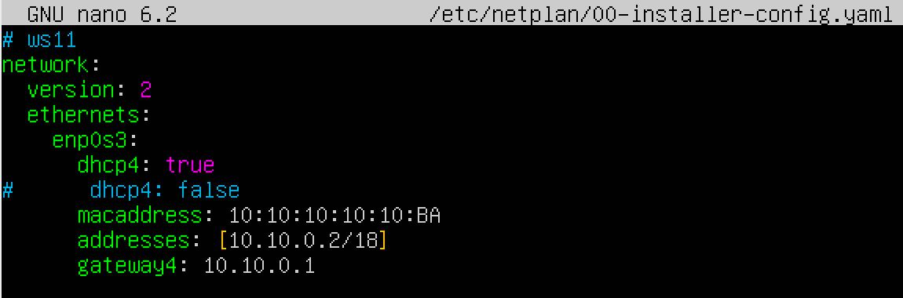\
*Измененный конфигурационный файл*

>`MAC (Media Access Control)` адрес - это тип адреса на втором (канальном, Data Link) уровне модели OSI, и является главным адресом на этом уровне.\
\
Адрес представляет собой уникальную комбинацию цифр и букв длиной 48 символов. Фактически, это аппаратный номер оборудования (компьютера, сервера, роутера, порта коммутатора, и т.д.), который присваивается сетевой карте устройства еще на фабрике.\
\
Но спецы из Мытищ в гаражных условиях перебивают VIN-номер автомобиля, так что и MAC-адрес можно перебить.\
\
MAC-адрес еще называют уникальным физическим адресом устройтсва, помогающим идентифицировать устройство среди миллионов других устройств. 

При желании MAC-адрес можно посмотреть здесь:

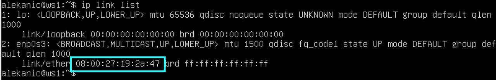\
*В поисках MAC-адреса*

+ **Для r1 настроить все аналогично r2, но сделать выдачу адресов с жесткой привязкой к MAC-адресу (ws11). Провести аналогичные тесты.**

  + Изменяем файл `/etc/dhcp/dhcpd.conf`:

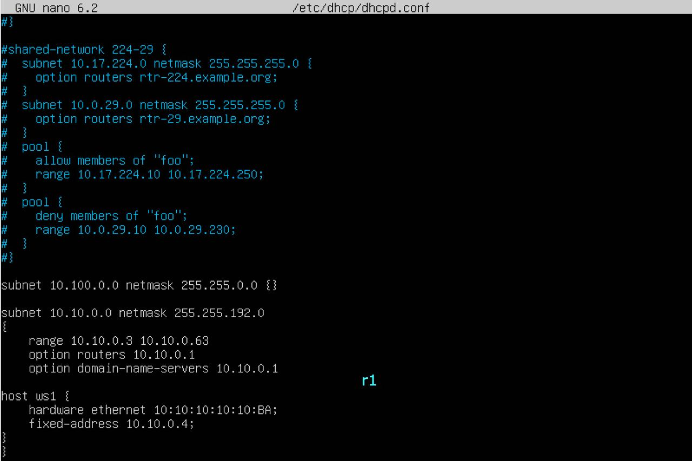\
*Измененный файл /etc/dhcp/dhcpd.conf для r1*

  + Изменяем файл `/etc/resolv/conf`:

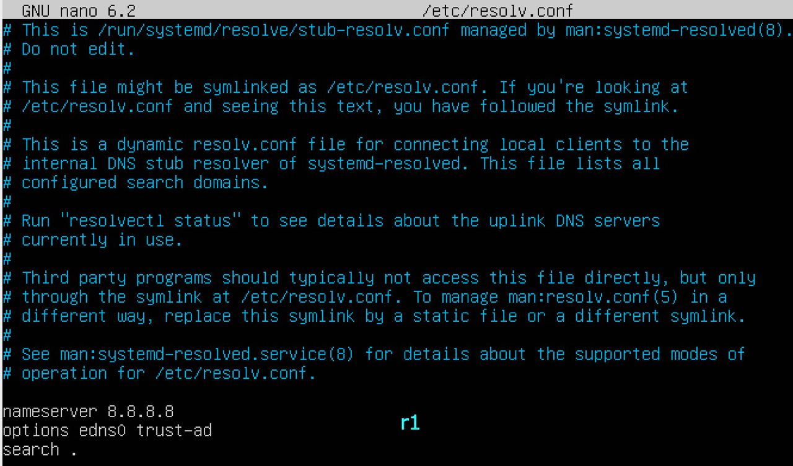\
*Измененный файл /etc/resolv.conf*

  + Перезапускаем dhcp-службу:

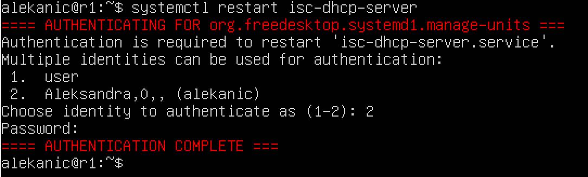\
*Рестарт dhcp-службы*

+ **Запросить с `ws21` обновление ip адреса. В отчёт поместить скрины ip до и после обновления. Описать, какими опциями DHCP сервера пользовались в данном пункте.**.

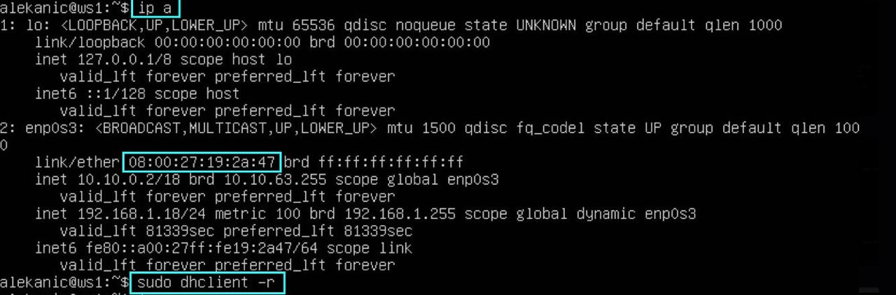\
*ws11 до обновления IP-адреса*\
\
Команда `$ sudo dhclient -r` используется для сброса состояния DHCP-клиента на сетевом интерфейсе. Если конкретный интерфейс не указан, DHCP-клиент сбрасывается на всех интерфейсах.

Далее, чтобы запросить обновление IP-адреса, нужно использовать команду `$ sudo dhclient` (можно с названием конкретного интерфейса, можно с опцией `-v`, для вывода подробной информации о процессе получения IP-адреса).

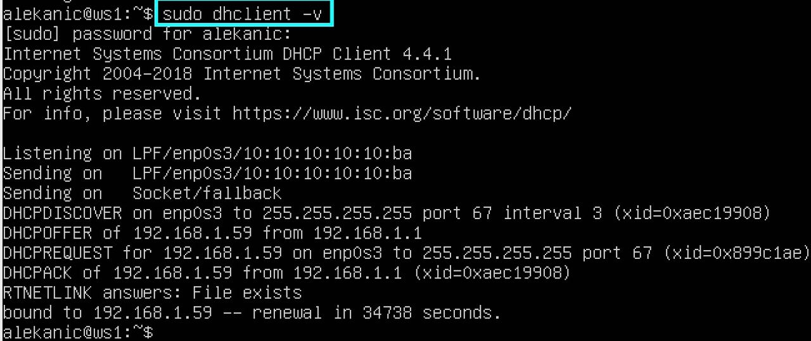\
*Получение нового адреса через DHCP*

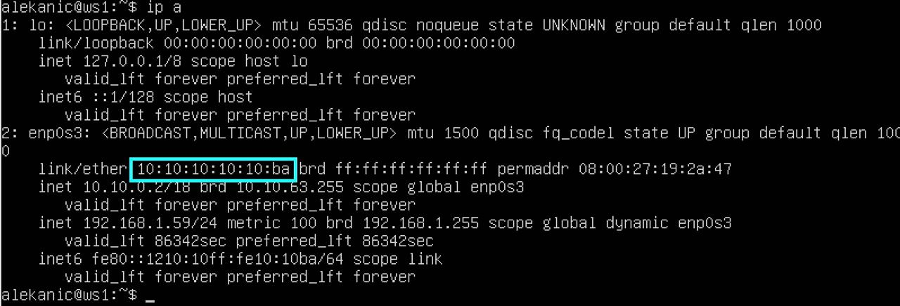\
*ws11 после обновления IP-адреса*

>**Зачем вообще нужна жесткая привязка IP к MAC-адресу?**\
\
Жесткая привязка IP-адресов к MAC-адресам называется статической привязкой или статическим назначением IP-адресов. Это означает, что каждому устройству в сети назначается уникальный IP-адрес, который остается неизменным независимо от того, подключено ли устройство к сети или нет.\
\
При настройке жесткой привязки IP-адресов к MAC-адресам, администратор сети должен вручную назначить IP-адрес каждому устройству в сети, основываясь на его MAC-адресе. Это делается путем внесения записей в таблицу трансляции адресов (ARP table) на маршрутизаторе или другом устройстве, которое управляет IP-адресацией в сети.\
\
К преимуществам относятся: улучшенная безопасность (сложнее скрыть свое присутствие в этой сети), упрощение управления сетью (легче отслеживать конкретные устройства), надежность (устраняет такие проблемы с DHCP, как конфликты IP-адресов и проблемы с роумингом).\
\
К недостаткам: сложность управления (настройка и поддержка довольно мумторные), проблемы с мастабируемостью (касается больших сетей), ограниченная гибкость (нельзя добавить новые устройства без предварительной настройки, сложно перемещать устройства между сетями).\
\
В целом, жесткая привязка IP-адресов к MAC-адресам может быть полезна в небольших сетях или в ситуациях, где требуется высокий уровень безопасности и контроля.


## <a id="title22">Part 7. NAT</a>

\
*mood on this part*

>`NAT (Network Address Translation)` - это механизм (трансляции сетевых адресов) в сетях TCP/IP, позволяющий изменять IP-адрес в заголовке пакета, проходящего через устройство маршрутизации трафика. Принимая пакет от локального компьютера, маршрутизатор смотрит на IP-адрес назначения. Если это локальный адрес, то пакет пересылается другому локальному компьютеру. Если нет, то пакет надо переслать наружу в интернет.\
\
Маршрутизатор подменяет обратный IP-адрес пакета на свой внешний (видимый из интернета) IP-адрес и меняет номер порта (чтобы различать ответные пакеты, адресованные разным локальным компьютерам). Комбинацию, нужную для обратной подстановки, маршрутизатор сохраняет у себя во временной таблице. Через некоторое время после того, как клиент и сервер закончат обмениваться пакетами, маршрутизатор сотрет у себя в таблице запись об n-ом порте за сроком давности.\
\
Основная функция NAT - сохранение публичных адресов, однако дополнительной функцией является конфиденциальность сети, путем скрытия внутренних IPv4 адресов от внешней.

В данном задании используются виртуальные машины из Части 5.

+ **В файле `/etc/apache2/ports.conf` на ws22 и r1 изменить строку `Listen 80` на `Listen 0.0.0.0:80`, то есть сделать сервер Apache2 общедоступным. В отчёт поместить скрин с содержанием изменённого файла.**

Чтобы этот файл вообще существовал, нужно сначала установить Apache2:
```
$ sudo apt install apache2
```
>`Apache` - это свободно-распространяемое ПО для размещения веб-сервера. Состоит из ядра (кстати, написанном на С) и динамической модульной системы. Параметры системы изменяются с помощью конфигурационных файлов.

Далее можно залезсть в сам файл `/etc/apache2/ports.conf` на `ws22` и `r1`: 

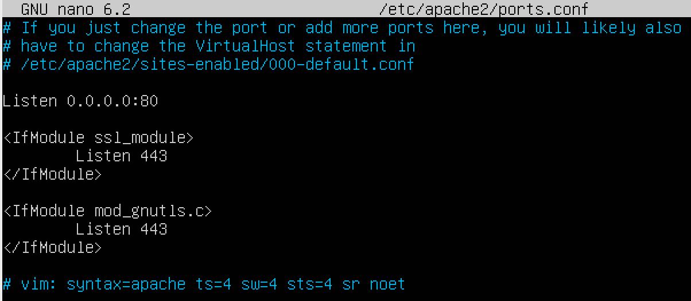\
*Изменения в конфигурационном файле apache*

+ **Запустить веб-сервер Apache командой `service apache2 start` на ws22 и r1. В отчёт поместить скрины с вызовом и выводом использованной команды.**

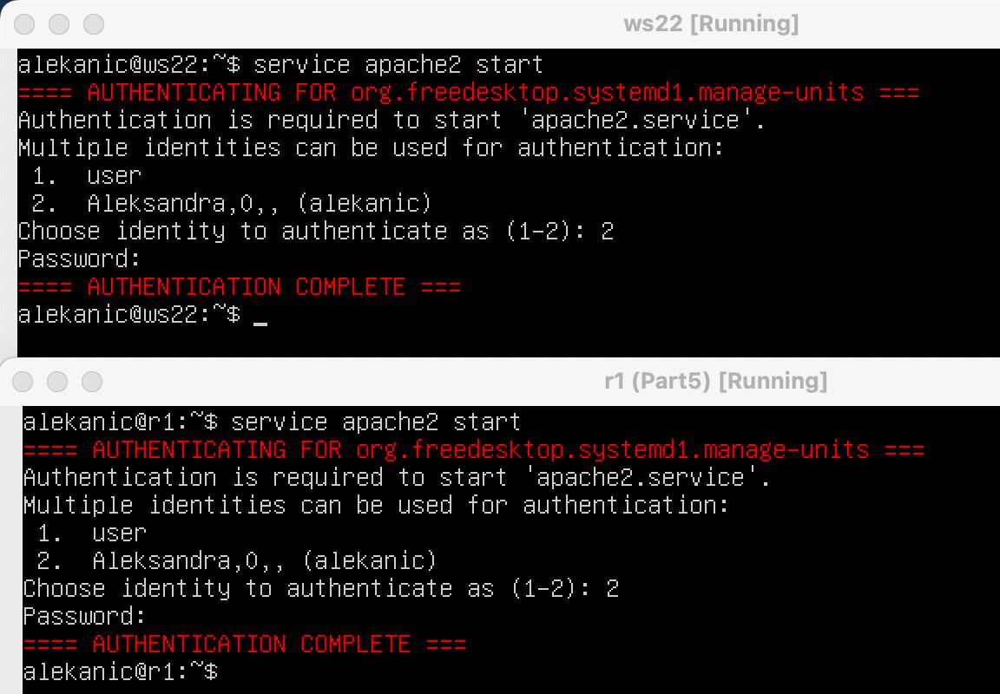\
*Запуск веб-сервера на ws22 и r1*

+ **Добавить в фаервол на r2 следующие правила:**

  + **Удаление правил в таблице filter - iptables -F;**
  + **Удаление правил в таблице "NAT" - iptables -F -t nat;**
  + **Отбрасывать все маршрутизируемые пакеты - iptables --policy FORWARD DROP.**

Создаем файл `/etc/firewall.sh` на `r2`. Лезем в него:

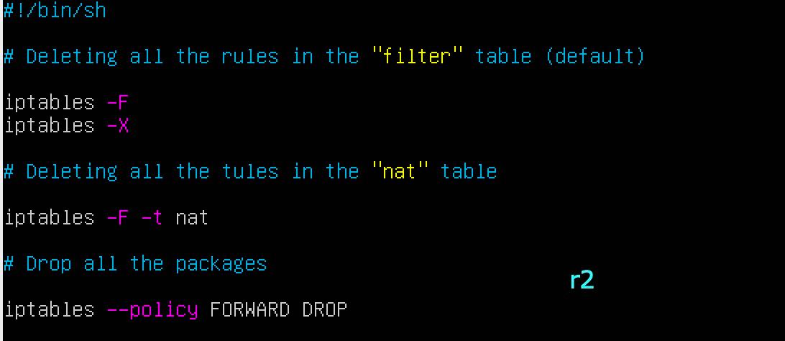\
*Изменения в файле /etc/firewall.sh у r2*

+ **Запустить фаервол**

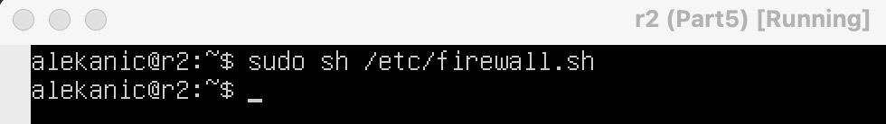\
*Запуск фаервола*

+ **Проверить соединение между ws22 и r1 командой ping. При запуске файла с этими правилами, ws22 не должна «пинговаться» с r1. В отчёт поместить скрины с вызовом и выводом использованной команды.**

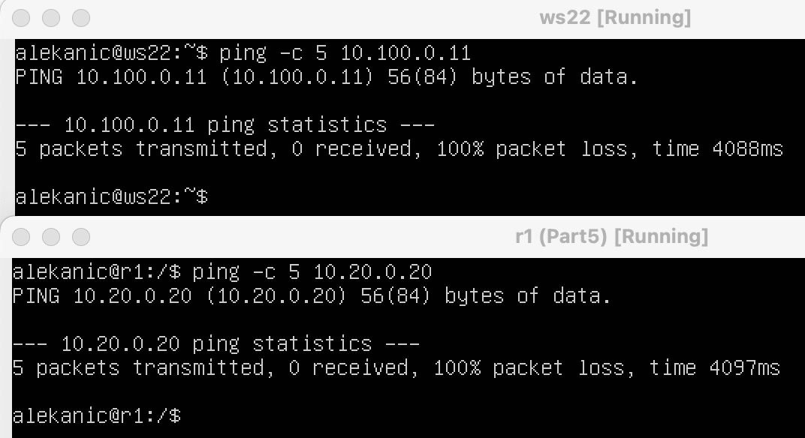\
*Пинг ws22 и r1*

+ **Добавить в файл ещё одно правило:**
  + **Разрешить маршрутизацию всех пакетов протокола ICMP.**

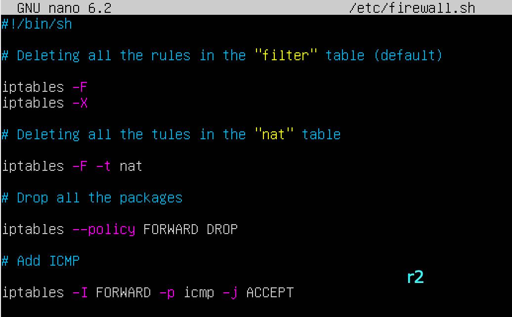\
*Обновленный файл /etc/firewall.sh у r2*

+ **Проверить соединение между ws22 и r1 командой ping. При запуске файла с этими правилами, ws22 должна «пинговаться» с r1. В отчёт поместить скрины с вызовом и выводом использованной команды.**

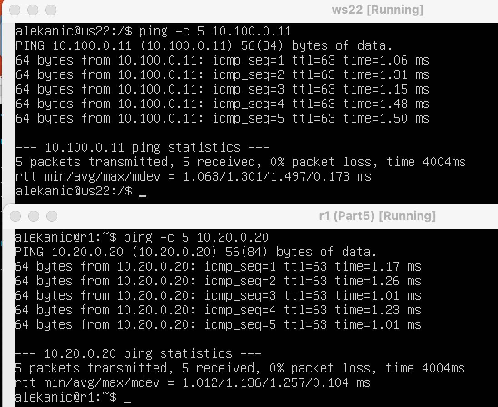\
*Пинг ws22 и r1*

+ **Добавить в файл ещё два правила:**
  + **Включить SNAT, а именно маскирование всех локальных ip из локальной сети, находящейся за r2 (по обозначениям из Части 5 - сеть 10.20.0.0). Совет: стоит подумать о маршрутизации внутренних пакетов, а также внешних пакетов с установленным соединением.**
  + **Включить DNAT на 8080 порт машины r2 и добавить к веб-серверу Apache, запущенному на ws22, доступ извне сети. Совет: стоит учесть, что при попытке подключения возникнет новое tcp-соединение, предназначенное ws22 и 80 порту. Запусти файл также, как в Части 4.**

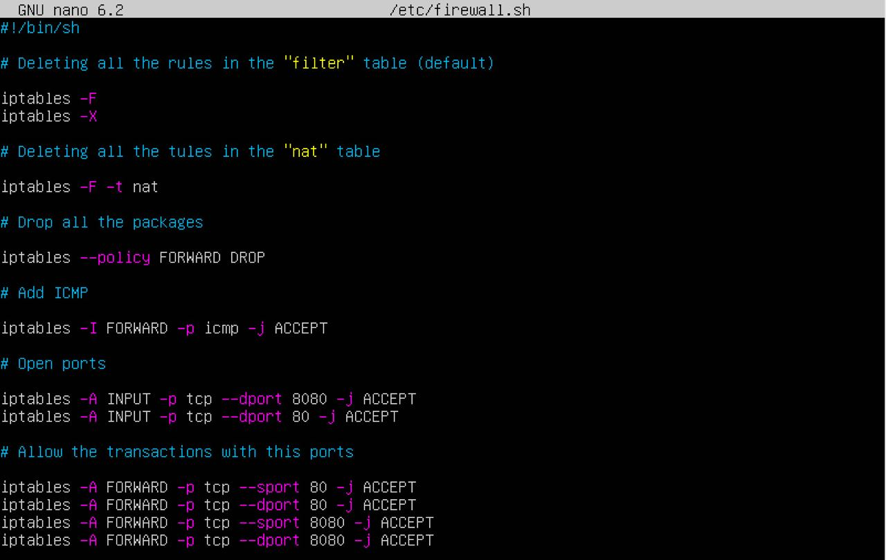
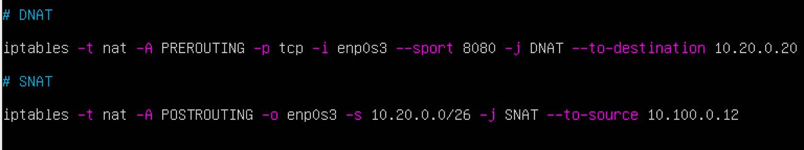\
*Обновленный файл /etc/firewall.sh у r2*

Запуск с помощью команды:
```
$ sudo sh /etc/firewall.sh
```
>`SNAT (Source Network Address Translation)` - это действие в таблице NAT, доступное в цепочке POSTROUTING. Это изменение адреса и порта источника пакета.\
\
`DNAT (Destination Network Address Translation)` - это действие в таблице NAT, доступное в цепочке PREROUTING и OUTPUT. Это изменение адреса и порта назначения пакета.\
\
Таким образом, изменить адрес и порт назначения мы можем только перед входом пакета в брандмауэр и до принятия решения о маршрутизации, а изменить адрес и порт источника можем только при выходе пакета из брандмауэра, после принятия решения о маршрутизации. SNAT - на выходе, DNAT - на входе.\
\
Одно из практических применений `SNAT` - обеспечение доступа локальной сети в интернет. `DNAT` - на практике используется в основном для проброса портов.

  + `FORWARD` - это цепочка, в которую добавляется правило. Цепочка `FORWARD` используется для фильтрации пакетов, которые проходят через устройство (например, компьютер с несколькими сетевыми интерфейсами или маршрутизатор).

У SNAT:

  + `-t` - ключ, который указывает используемую таблицу, если данный ключ не указан, по умолчанию используется таблица `filter`
  + `-o (-out-interface)` - исходящий интерфейс
  + `--to-source` - используется для указания адреса, присваиваемому пакету, теперь именно этот адрес будет указывать в качестве исходящего
  + `-s (-src, -source-адрес)` - IP-адрес (или диапазон) получателя пакета

У DNAT:

  + `-d (-dst, -destination)` - IP-адрес получателя
  + `-i (-in-interface)` - определяет входящий сетевой интерфейс

Неявные критерии (должен быть указан протокол -p tcp):

  + `-sport (-source-port)` - исходный порт, с которого был отправлен пакет
  + `-dport, (-destination-port)` - порт, или диапазон портов, на которые адресован пакет 

+ **Перед тестированием рекомендуется отключить сетевой интерфейс NAT (его наличие можно проверить командой ip a) в VirtualBox, если он включен. Проверить соединение по TCP для SNAT: для этого с ws22 нужно подключиться к серверу Apache на r1 командой: telnet [адрес] [порт]**

Утилита `telnet` устанавливается командой: 
```
$ sudo apt install telnet
```
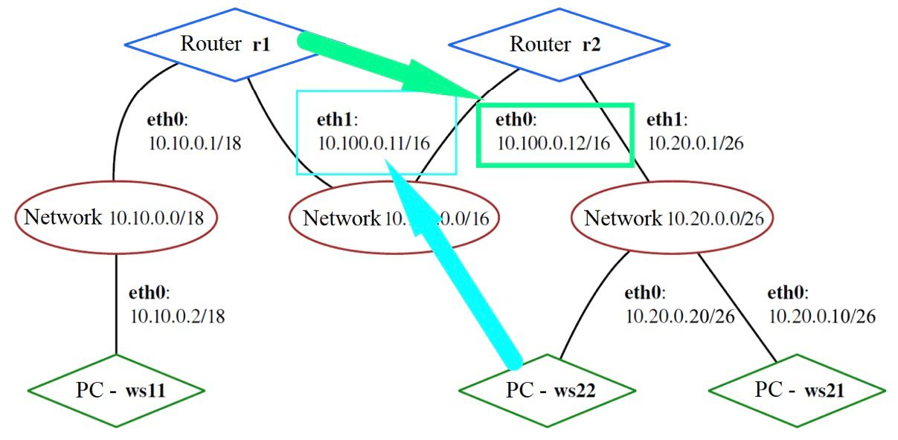\
*Памятка*

До использования команды `telnet`, нужно проверить, что сервер `apache2` включен на `ws22` и `r1`. Поэтому на всякий случай:

\
*Запуск сервиса apache2*

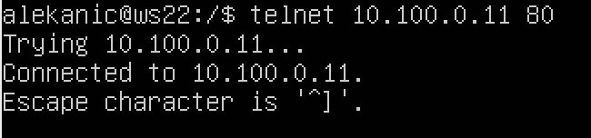\
*Использование telnet на ws22*

+ **Проверить соединение по TCP для DNAT: для этого с r1 подключиться к серверу Apache на ws22 командой telnet (обращаться по адресу r2 и порту 8080).**

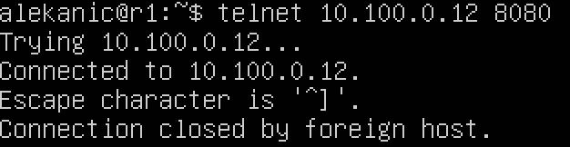\
*Использование telnet на r1*

С портом 8080 у меня возникли проблемы. На 3-х машинах: ws21, r1, r2 его не было в списке открытых портов, поэтому я добавила его отдельно в файл `/etc/apache2/ports.conf`:

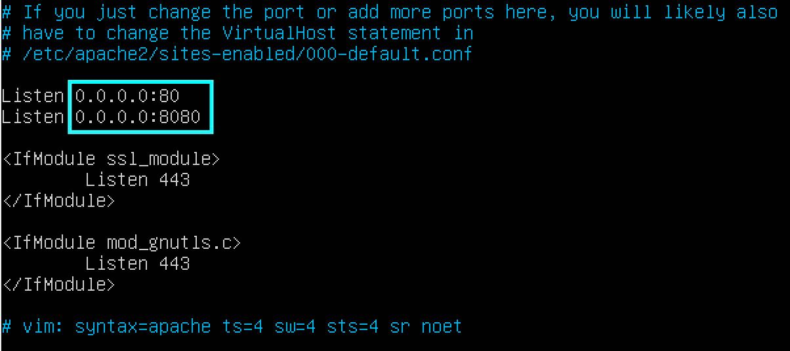\
*Добавление порта 8080*\
\
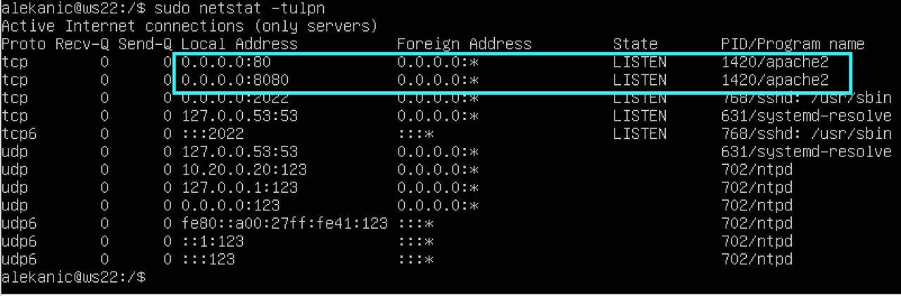\
*Проверка добавления порта 8080*

>`telnet` - это утилита, которая позволяет проводить соединение с удаленным портом и устанавливать интерактивный канал связи для передачи команд или получения данных. Можно встретить название - `универсальный браузер терминала`, потому что программа способна работать с различными протоколами.\
\
Протокол `telnet`, созданный на основе TCP, позволяет передавать на удаленный сервер простые текстовые команды для ручного управления процессами и включения взаимодействия между ними.

## <a id="title23">Part 8. Дополнительно. Знакомство с SSH Tunnels</a>

>Переброс порта SSH дает возможность создавать туннель между несколькими системами, а затем настроить эти системы так, чтобы трафик они гнали через этот туннель. Именно по такой логике работает VPN или SOCKS Proxy.\
\
Есть несколько разных методов переброса:\
\
`Локальный переброс порта` - позволяет получать доступ ко внешним ресурсам из локальной сети и работать в удаленной системе, как если бы они находились в одной локальной сети. По таком принципу работает Remote Access VPN.\
\
`Переброс удаленного порта` - дает возможность удаленной системе получать доступ к вашей локальной сети.\
\
`Динамический переброс` - создает SOCKS прокси сервер. Чаще всего такой переброс используется для доступа к ресурсам, которые по той или иной причине заблокированы для данной страны.

В данном задании используются виртуальные машины из Части 5.

+ **Запустить на r2 фаервол с правилами из Части 7.**


\
*Обновленный файл /etc/firewall.sh у r2*

+ **Запустить веб-сервер Apache на ws22 только на localhost (то есть в файле /etc/apache2/ports.conf измени строку Listen 80 на Listen localhost:80).**

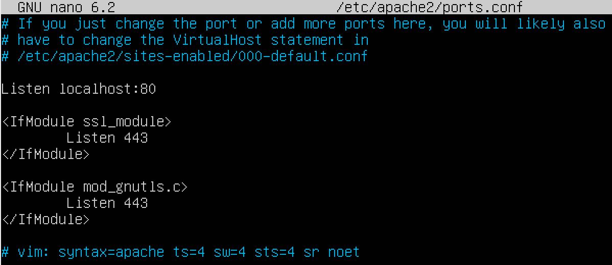\
*Измененный файл etc/apache2/ports.conf*\
\
Перезапуск apache2:
```
$ sudo systemctl restart apache2
$ system apache2 start
```
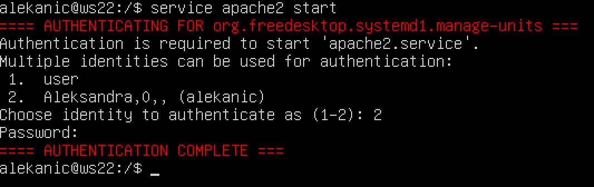\
*Запуск системы apache2*

+ **Воспользоваться Local TCP forwarding с ws21 до ws22, чтобы получить доступ к веб-серверу на ws22 с ws21.**

>`Переброс локального порта` - представляет собой переброс порта из клиентской системы на сервер. Он позволяет настроить порт в системе таким образом, чтобы все соединения на этот порт проходили через туннель SSH.

\
*Cинтаксис Local TCP forwarding*

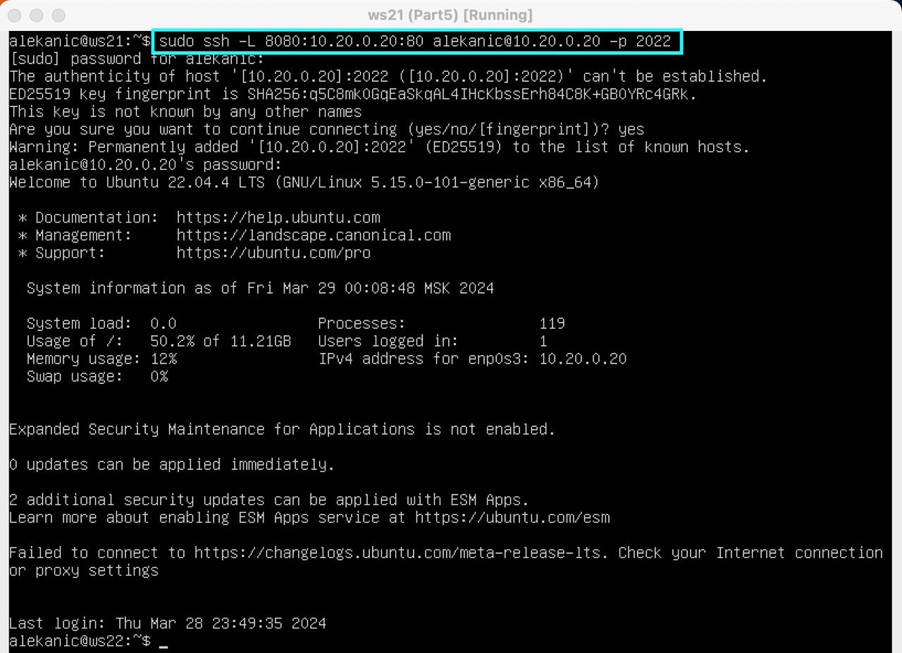\
*Переброс локального порта*

Данной командой мы говорим, что все запросы на порт 8080 хоста с адресом 10.20.0.20 нужно переадресовывать на пользователя alekanic на хост по адресу 10.20.0.20. Можно использовать, когда нужно организовать доступ извне на внутренние ресурсы компании.

+ **Воспользоваться Remote TCP forwarding c ws11 до ws22, чтобы получить доступ к веб-серверу на ws22 с ws11.**

>`Переброс удаленного порта` - используется в тех случаях, когла нужно предоставлять доступ на свой хост. 

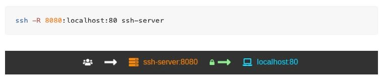\
*Cинтаксис Remote TCP forwarding*\
\
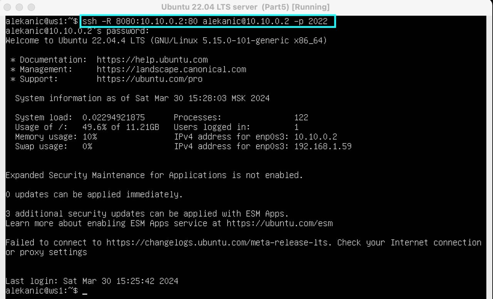\
*Remote TCP forwarding*

Данная команда перенаправляет трафик с порта 80 (alekanic@10.20.0.20) на порт 8080 хоста по адресу 10.10.0.2.

+ **Для проверки, сработало ли подключение в обоих предыдущих пунктах, выполнить команду: `telnet 127.0.0.1 [локальный порт]`**

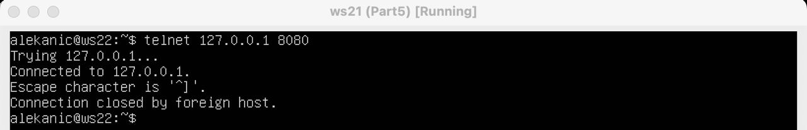\
*Доступ с ws21 на локальный сервер ws22*

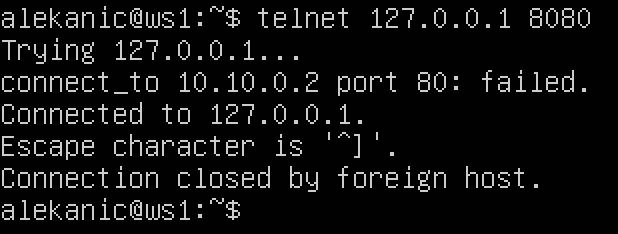\
*Доступ с ws11 на локальный сервер ws22*